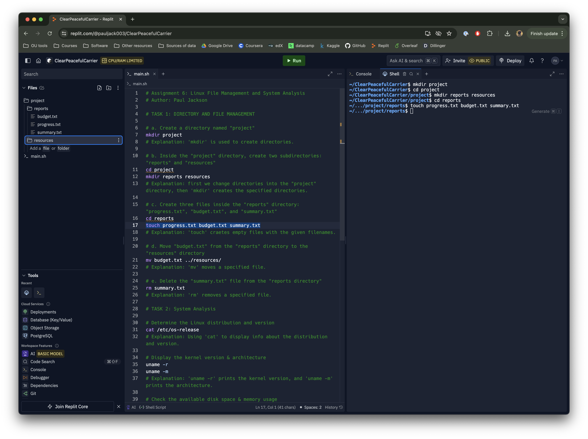
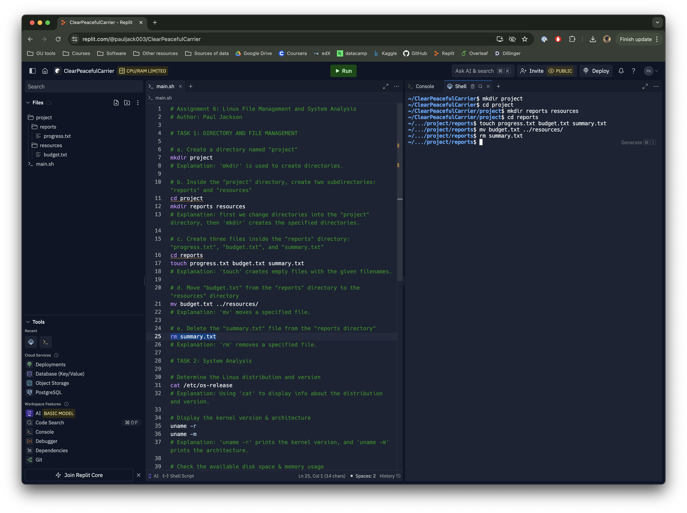
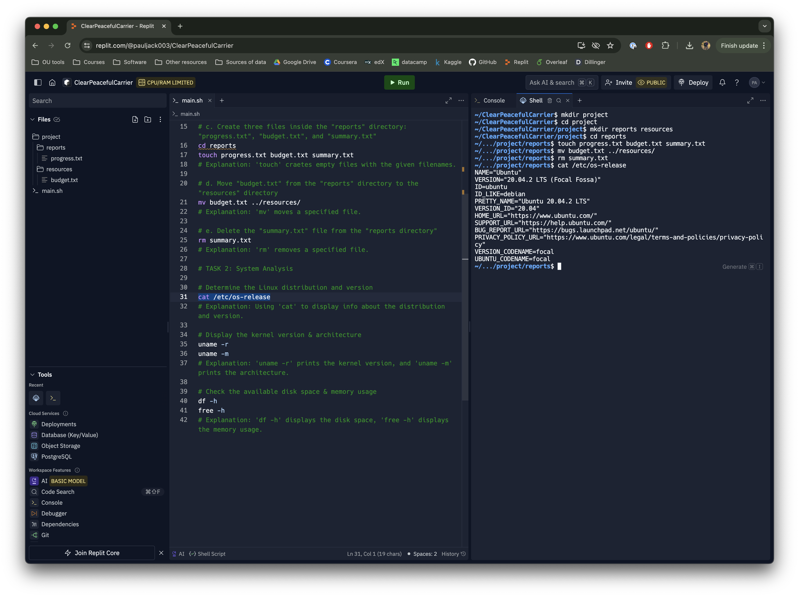
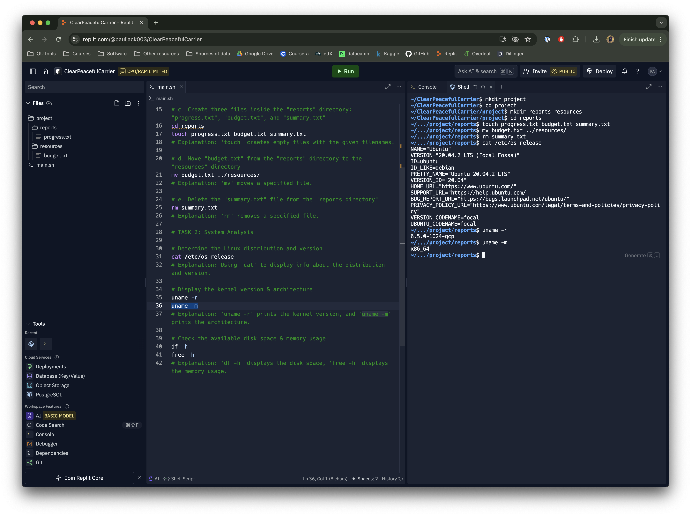
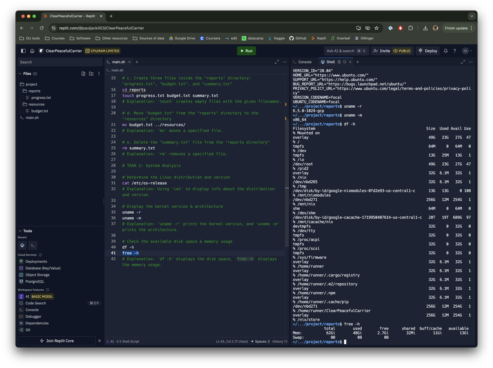

Assignment 6
================
Paul Jackson
2024-07-20

# Linux File Management and System Analysis

I completed this assignment using a Repl.it BASH container, capturing
screenshots as I went. This final project output summarizes each step
taken. At the end, I then provide the full shell script used to complete
the assignment and associated explanations of each command via
commenting in the code.

## Task 1: Directory and file management

The first part of this project required basic file manipulation tasks as
summarized and shown below.

1.  **Creation**

    The first series of commands required for this assignment involved
    creating directories and associated files, as shown in the
    screenshot below.

    

2.  **Move**

    Once created, we were then tasked with moving one of the files from
    one directory to another. That process is shown in the screenshot
    below.

    

3.  **Remove**

    We then were tasked with deleting one of the files we’d created.
    That is shown in the screenshot below.

    

## Task 2: System analysis

The second part of this project required basic analysis of key system
variables as summarized below.

1.  **Linux distribution and version**

    There are numerous methods to obtain information about the available
    Linux distribution, but the class lecture made it clear that we
    should use the “cat” method in this case. The implementation of that
    code call is shown below.

    

2.  **Kernel version and architecture**

    Displaying the kernel version and architecture is accomplished as
    shown in the image below.

    

3.  **Available disk space & memory usage**

    The last task required an assessment of disk space and memory usage
    as shown below.

    

## Task 3: Documentation

To ensure reproducibility, and to provide an explation of each step
inline with the associated command, below is the shell script I wrote to
accomplish the above tasks in its entirety. This should meet the stated
documentation requirements for this project.

``` bash
# Assignment 6: Linux File Management and System Analysis
# Author: Paul Jackson

# TASK 1: DIRECTORY AND FILE MANAGEMENT

# a. Create a directory named "project"
mkdir project
# Explanation: 'mkdir' is used to create directories.

# b. Inside the "project" directory, create two subdirectories:
# "reports" and "resources"
cd project
mkdir reports resources
# Explanation: first we change directories into the "project" directory 
# then 'mkdir' creates the specified directories.

# c. Create three files inside the "reports" directory: "progress.txt", 
# "budget.txt", and "summary.txt"
cd reports
touch progress.txt budget.txt summary.txt
# Explanation: 'touch' craetes empty files with the given filenames.

# d. Move "budget.txt" from the "reports" directory to the "resources" 
# directory
mv budget.txt ../resources/
# Explanation: 'mv' moves a specified file.

# e. Delete the "summary.txt" file from the "reports directory"
rm summary.txt
# Explanation: 'rm' removes a specified file.

# TASK 2: System Analysis

# Determine the Linux distribution and version
cat /etc/os-release
# Explanation: Using 'cat' to display info about the distribution and 
# version.

# Display the kernel version & architecture
uname -r
uname -m
# Explanation: 'uname -r' prints the kernel version, and 'uname -m' 
# prints the architecture.

# Check the available disk space & memory usage
df -h
free -h
# Explanation: 'df -h' displays the disk space, 'free -h' displays the 
# memory usage.
```
