# 1 Data visualization

Basics first:

    library(tidyverse)

    ## ── Attaching core tidyverse packages ──────────────────────── tidyverse 2.0.0 ──
    ## ✔ dplyr     1.1.4     ✔ readr     2.1.5
    ## ✔ forcats   1.0.0     ✔ stringr   1.5.1
    ## ✔ ggplot2   3.5.1     ✔ tibble    3.2.1
    ## ✔ lubridate 1.9.3     ✔ tidyr     1.3.1
    ## ✔ purrr     1.0.2     
    ## ── Conflicts ────────────────────────────────────────── tidyverse_conflicts() ──
    ## ✖ dplyr::filter() masks stats::filter()
    ## ✖ dplyr::lag()    masks stats::lag()
    ## ℹ Use the conflicted package (<http://conflicted.r-lib.org/>) to force all conflicts to become errors

    library(palmerpenguins)
    library(ggthemes)

## 1.2.5 Exercises

**1. How many rows are in penguins? How many columns?**

    glimpse(penguins)

    ## Rows: 344
    ## Columns: 8
    ## $ species           <fct> Adelie, Adelie, Adelie, Adelie, Adelie, Adelie, Adel…
    ## $ island            <fct> Torgersen, Torgersen, Torgersen, Torgersen, Torgerse…
    ## $ bill_length_mm    <dbl> 39.1, 39.5, 40.3, NA, 36.7, 39.3, 38.9, 39.2, 34.1, …
    ## $ bill_depth_mm     <dbl> 18.7, 17.4, 18.0, NA, 19.3, 20.6, 17.8, 19.6, 18.1, …
    ## $ flipper_length_mm <int> 181, 186, 195, NA, 193, 190, 181, 195, 193, 190, 186…
    ## $ body_mass_g       <int> 3750, 3800, 3250, NA, 3450, 3650, 3625, 4675, 3475, …
    ## $ sex               <fct> male, female, female, NA, female, male, female, male…
    ## $ year              <int> 2007, 2007, 2007, 2007, 2007, 2007, 2007, 2007, 2007…

344 rows, 8 columns.

**2. What does the `bill_depth_mm` variable in the `penguins` data
describe? Read the help for `?penguins` to find out.**

Per the help file, the variable `bill_depth_mm` represents a number
denoting bill depth in millimeters.

**3. Make a scatterplot of `bill_depth_mm` vs `bill_length_mm`. Describe
the relationship between these two variables.**

    ggplot(penguins, aes(x = bill_length_mm, y = bill_depth_mm)) +
      geom_point(na.rm = TRUE)

I’m not sure here if I’d say there is a strong relationship. I do think
looking at this by species would likely show some strong relationships,
but that isn’t the question.

**4. What happens if you make a scatterplot of `species` vs
`bill_depth_mm`? What might be a better choice of geom?**

    ggplot(penguins, aes(x = bill_depth_mm, y = species)) +
             geom_point(na.rm = TRUE)

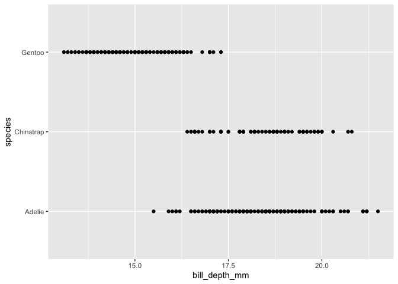

Because species is categorical, a scatterplot isn’t very useful. But a
boxplot can be a useful way to compare a categorical and numerical
variable set.

    ggplot(penguins, aes(x = bill_depth_mm, y = species)) +
             geom_boxplot(na.rm = TRUE)

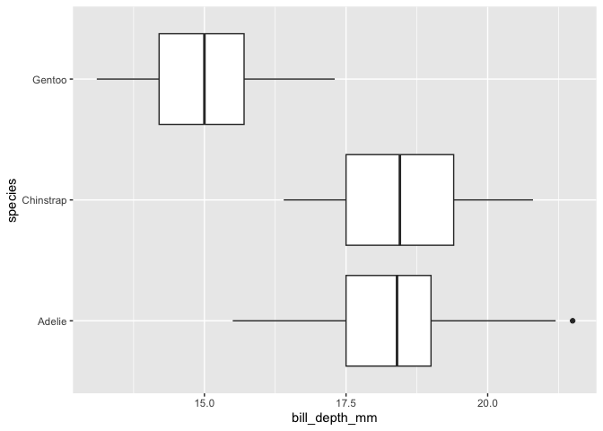

**5. Why does the following give an error and how would you fix it?**

    ggplot(data = penguins) + 
      geom_point()

The above code doesn’t have any mapping arguments via aes. Corrected
code as shown:

    ggplot(data = penguins, mapping = aes(x = flipper_length_mm, y = body_mass_g)) + 
      geom_point()

    ## Warning: Removed 2 rows containing missing values or values outside the scale range
    ## (`geom_point()`).

**6. What does the `na.rm` argument do in `geom_point()`? What is the
default value of the argument? Create a scatterplot where you
successfully use this argument set to true.**

This argument ignores NA values in the dataset. Example usage below:

    ggplot(data = penguins, mapping = aes(x = flipper_length_mm, y = body_mass_g)) + 
      geom_point(na.rm = TRUE)

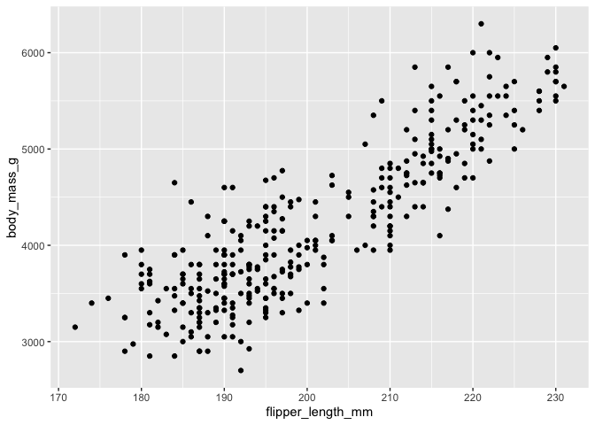

**7. Add the following caption to the plot you made in the previous
exercise: “Data come from the palmerpenguins package.”**

    ggplot(data = penguins, mapping = aes(x = flipper_length_mm, y = body_mass_g)) + 
      geom_point() + 
      labs(caption = "Data come from the palmerpenguins package.")

    ## Warning: Removed 2 rows containing missing values or values outside the scale range
    ## (`geom_point()`).

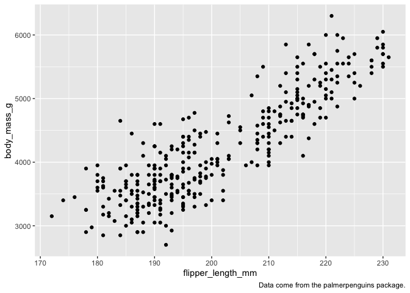

**8. Recreate the visualization shown. What aesthetic should
`bill_depth_mm` be mapped to? And should it be mapped at the global or
at the geom level?**

    ggplot(data = penguins, mapping = aes(x = flipper_length_mm, y = body_mass_g)) + 
      geom_point(aes(color = bill_depth_mm)) +
      geom_smooth()

    ## `geom_smooth()` using method = 'loess' and formula = 'y ~ x'

    ## Warning: Removed 2 rows containing non-finite outside the scale range
    ## (`stat_smooth()`).

    ## Warning: Removed 2 rows containing missing values or values outside the scale range
    ## (`geom_point()`).

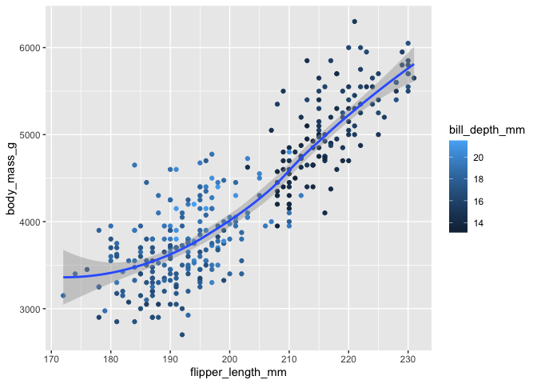

The code is shown above. The variable `bill_depth_mm` should be mapped
to the local point instance; assigning it to the global mapping would
affect the line curve’s color.

**9. Run this code, predict the output first. Did it do what you
thought?**

My prediction is we’ll get three color coded point areas, each color
representing an island. Then we’ll get a curved line fitting each of the
islands, without the standard error shading.

    ggplot(
      data = penguins,
      mapping = aes(x = flipper_length_mm, y = body_mass_g, color = island)
    ) +
      geom_point() +
      geom_smooth(se = FALSE)

    ## `geom_smooth()` using method = 'loess' and formula = 'y ~ x'

    ## Warning: Removed 2 rows containing non-finite outside the scale range
    ## (`stat_smooth()`).

    ## Warning: Removed 2 rows containing missing values or values outside the scale range
    ## (`geom_point()`).

My prediction was correct!

**10. Will these two graphs look different? Why/why not?**

I expect they will be the same. In the first, we’re defining data and
mapping globally. In the second, we’re defining data and mapping
locally.

    ggplot(
      data = penguins,
      mapping = aes(x = flipper_length_mm, y = body_mass_g)
    ) +
      geom_point() +
      geom_smooth()

    ## `geom_smooth()` using method = 'loess' and formula = 'y ~ x'

    ## Warning: Removed 2 rows containing non-finite outside the scale range
    ## (`stat_smooth()`).

    ## Warning: Removed 2 rows containing missing values or values outside the scale range
    ## (`geom_point()`).

    ggplot() +
      geom_point(
        data = penguins,
        mapping = aes(x = flipper_length_mm, y = body_mass_g)
      ) +
      geom_smooth(
        data = penguins,
        mapping = aes(x = flipper_length_mm, y = body_mass_g)
      )

    ## `geom_smooth()` using method = 'loess' and formula = 'y ~ x'

    ## Warning: Removed 2 rows containing non-finite outside the scale range (`stat_smooth()`).
    ## Removed 2 rows containing missing values or values outside the scale range
    ## (`geom_point()`).

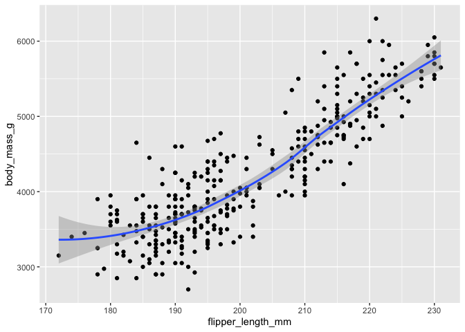

I was correct, they look the same.

## 1.4.3 Exercises

**1. Make a bar plot of species of penguins where you assign species to
y. How does this change the bar plot?**

It will move the bars horizontal, off the y axis, as shown:

    ggplot(penguins, aes(y=species)) +
      geom_bar()

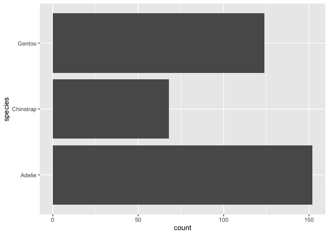

**2. How are the following two plots different? Which aesthetic, color
or fill, is more useful for changing the color of bars?**

    #lets go side by side
    library(patchwork)

    p1 <- ggplot(penguins, aes(x = species)) +
      geom_bar(color = "red")

    p2 <- ggplot(penguins, aes(x = species)) +
      geom_bar(fill = "red")

    p1 + p2

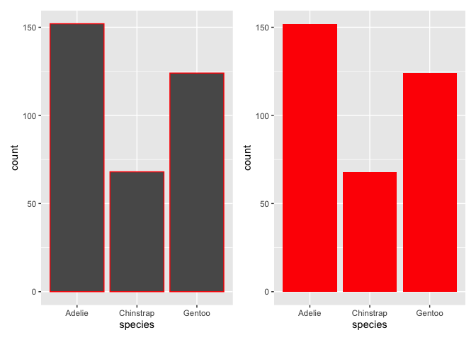

Fill is far more useful for changing bar colors.

**3. What does the bins argument in geom\_histogram() do?**

It determines the number of bars/bins on the chart.

**4. Make a histogram of the `carat` variable in the `diamonds` dataset
that is available when you load the tidyverse package. What binwidth is
the most useful?**

    p1 <- ggplot(diamonds, aes(x=carat)) +
      geom_histogram(binwidth = 0.1)

    p2 <- ggplot(diamonds, aes(x=carat)) +
      geom_histogram(binwidth = 0.5)

    p3 <- ggplot(diamonds, aes(x=carat)) +
      geom_histogram(binwidth = 1.0)

    p1 + p2 + p3

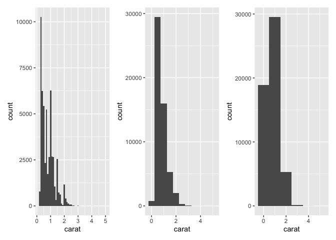

It looks like a binwidth value of .5 works best here.

## 1.5.5 Exercises

**1. Which variables in `mpg` are categorical? Which variables are
numerical? How can you see this information when you run mpg?**

    glimpse(mpg)

    ## Rows: 234
    ## Columns: 11
    ## $ manufacturer <chr> "audi", "audi", "audi", "audi", "audi", "audi", "audi", "…
    ## $ model        <chr> "a4", "a4", "a4", "a4", "a4", "a4", "a4", "a4 quattro", "…
    ## $ displ        <dbl> 1.8, 1.8, 2.0, 2.0, 2.8, 2.8, 3.1, 1.8, 1.8, 2.0, 2.0, 2.…
    ## $ year         <int> 1999, 1999, 2008, 2008, 1999, 1999, 2008, 1999, 1999, 200…
    ## $ cyl          <int> 4, 4, 4, 4, 6, 6, 6, 4, 4, 4, 4, 6, 6, 6, 6, 6, 6, 8, 8, …
    ## $ trans        <chr> "auto(l5)", "manual(m5)", "manual(m6)", "auto(av)", "auto…
    ## $ drv          <chr> "f", "f", "f", "f", "f", "f", "f", "4", "4", "4", "4", "4…
    ## $ cty          <int> 18, 21, 20, 21, 16, 18, 18, 18, 16, 20, 19, 15, 17, 17, 1…
    ## $ hwy          <int> 29, 29, 31, 30, 26, 26, 27, 26, 25, 28, 27, 25, 25, 25, 2…
    ## $ fl           <chr> "p", "p", "p", "p", "p", "p", "p", "p", "p", "p", "p", "p…
    ## $ class        <chr> "compact", "compact", "compact", "compact", "compact", "c…

-   Categorical: manufacturer, model, trans, drv, fl, class
-   Numerical: displ, year, cyl, cty, hwy

You can see this information by running the `glimpse()` dplyr function.

**2. Make a scatterplot of `hwy` vs `displ`; then made a third numerical
value to `color`, then `size`, then both `color` and `size`, then
`shape`. How do these behave differently for categorical vs. numerical
values?**

The shape argument fails when trying to employ a numerical variable;
categorical is required. For both color and size, a numerical value is
acceptable (although not neccessarily useful, as that will be context
dependent).

The code below required me to use a categorical variable (I chose `drv`)
in order for the RMD file to properly knit, as an example.

    p1 <- ggplot(
      mpg, 
      aes(x = hwy, y = displ, color = cty)
    ) + 
      geom_point()

    p2 <- ggplot(
      mpg, 
      aes(x = hwy, y = displ, size = cty)
    ) + 
      geom_point()

    p3 <- ggplot(
      mpg, 
      aes(x = hwy, y = displ, size = cty, color = cty)
    ) + 
      geom_point()

    p4 <- ggplot(
      mpg, 
      aes(x = hwy, y = displ, size = cty, color = cty, shape = drv)
    ) + 
      geom_point()

    (p1 | p2) / (p3 | p4)

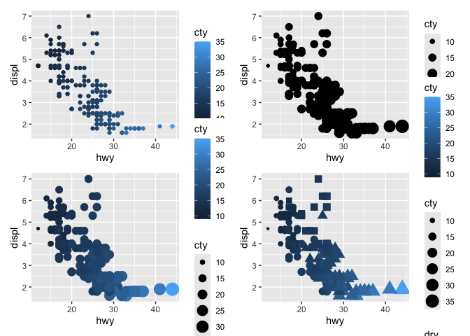

**3. In the scatterplot above, what happens if you map a third variable
to linewidth?**

I don’t have to map this to know. Nothing happens because there isn’t a
line specified in the aes() statement, so there isn’t a line to vary the
width of.

**4. What happens if you map the same variable to multiple aesthetics?**

ggplot will generate *something*, but it likely won’t be useful. Imagine
mapping an x axis onto the y axis – you’ll just get a line. Here is an
example:

    ggplot(mpg, aes(x=cty, y=cty, size=cty)) +
      geom_point()

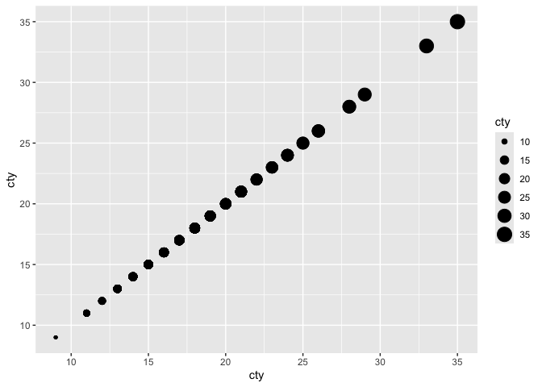

oooooooh, thanks for showing me that 35 &gt; 10. Needed a chart for
that. LOL.

**5. Make a scatterplot of `bill_depth_mm` vs `bill_length_mm` and color
the points by species. What does adding color reveal? What about
faceting by species?**

    ggplot(penguins, aes(x = bill_length_mm, y = bill_depth_mm, color = species)) +
      geom_point()

    ## Warning: Removed 2 rows containing missing values or values outside the scale range
    ## (`geom_point()`).

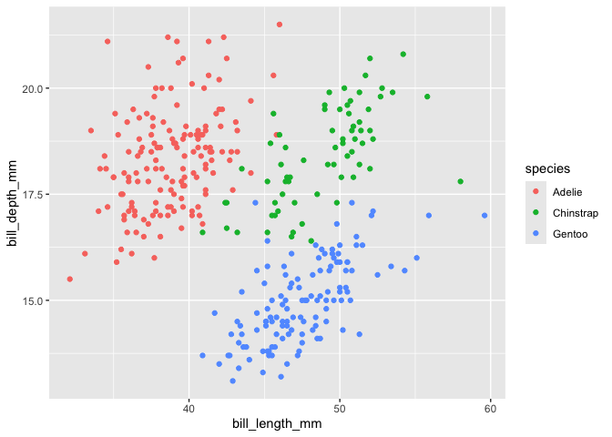

Adding color makes it cleaar there is a strong linear relationship
between the two variables once you account for the species.

Using faceting, we get a similar view:

    ggplot(penguins, aes(x = bill_length_mm, y = bill_depth_mm)) +
      geom_point() +
      facet_wrap(~species)

    ## Warning: Removed 2 rows containing missing values or values outside the scale range
    ## (`geom_point()`).

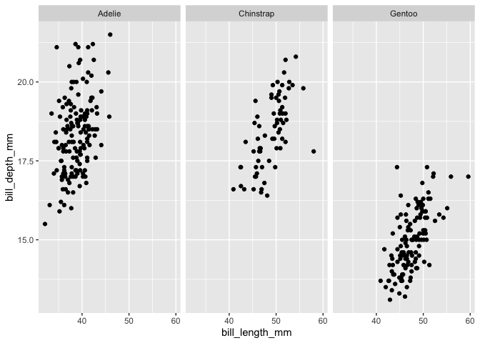

**6. Why does the following yield two seperate legends? How would you
fix it to combine the legends?**

    ggplot(
      data = penguins,
      mapping = aes(
        x = bill_length_mm, y = bill_depth_mm, 
        color = species, shape = species
      )
    ) +
      geom_point() +
      labs(color = "Species")

The problem above: only color has a renamed legend to Species, while
shape does not. To fix this, just add in shape.

    ggplot(
      data = penguins,
      mapping = aes(
        x = bill_length_mm, y = bill_depth_mm, 
        color = species, shape = species
      )
    ) +
      geom_point() +
      labs(color = "Species",
           shape = "Species")

    ## Warning: Removed 2 rows containing missing values or values outside the scale range
    ## (`geom_point()`).

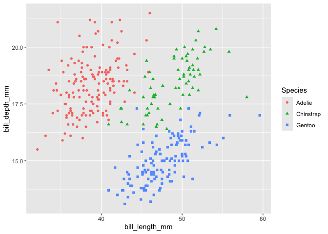

\*\*7. Create the two stacked bar plots in the code shown below. What
question does the first plot answer? The second one?

    ggplot(penguins, aes(x = island, fill = species)) +
      geom_bar(position = "fill")

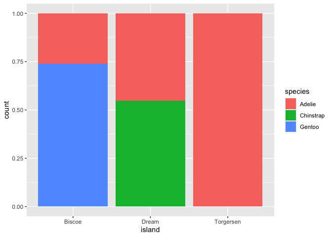

    ggplot(penguins, aes(x = species, fill = island)) +
      geom_bar(position = "fill")

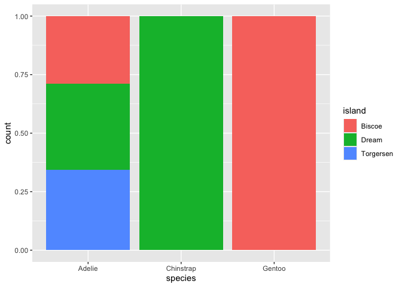

The first bar plot tells us: which species live on each island? The
second bar plot tells us: on which islands can a species be found?
Similar, but slightly different questions.

## 1.6.1 Exercises

**1. Which of the two plots is saved from the below code?**

    ggplot(mpg, aes(x = class)) +
      geom_bar()
    ggplot(mpg, aes(x = cty, y = hwy)) +
      geom_point()
    ggsave("mpg-plot.png")

It will be the second plot. `ggsave` will execute a save on the most
recently run plot, whatever it is.

**2. What needs to change to save the plot as a PDF? How can you
determine what types of files work with `ggsave()`?**

Just rename the output to \*.pdf. If you look up `?ggsave` you can get
details.

# 2. Workflow basics

## 2.5 Exercises

**1. Why does this code not work?**

    my_variable <- 10
    my_varıable

Obviously there is a mismatch in variable names here.

**2. Tweak these R commands so they run correctly.**

Given set:

    libary(todyverse)

    ggplot(dTA = mpg) + 
      geom_point(maping = aes(x = displ y = hwy)) +
      geom_smooth(method = "lm)

Fixed set:

    library(tidyverse)

    ggplot(data = mpg, mapping = aes(x = displ, y = hwy)) + 
      geom_point() +
      geom_smooth(method = "lm")

    ## `geom_smooth()` using formula = 'y ~ x'

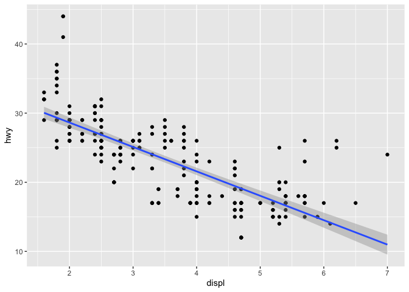

**3. What happens with Option-Shift-K?**

Keyboard shortcuts are shown.

**4. Which of the two plots is saved? Why?**

    my_bar_plot <- ggplot(mpg, aes(x = class)) +
      geom_bar()
    my_scatter_plot <- ggplot(mpg, aes(x = cty, y = hwy)) +
      geom_point()
    ggsave(filename = "mpg-plot.png", plot = my_bar_plot)

The plot saved to `my_bar_plot` is saved. The function defaults to the
most recent plot unless given an express instruction to save something
else.

# 3. Data transformation

Load prequisites.

    library(nycflights13)

## 3.2.5 Exercises

**1. In a single pipe for each condition, find all flights that:**

-   had an arrival delay of two or more hours;
-   flew to IAH or HOU;
-   were operated by UA, AA, DL;
-   departed in July, August and September;
-   arrived more than two hours late, but didn’t leave late;
-   were delayed by at least an hour, but made up over 30 minutes in
    flight.

<!-- -->

    flights |>
     filter(arr_delay >= 120)

    ## # A tibble: 10,200 × 19
    ##     year month   day dep_time sched_dep_time dep_delay arr_time sched_arr_time
    ##    <int> <int> <int>    <int>          <int>     <dbl>    <int>          <int>
    ##  1  2013     1     1      811            630       101     1047            830
    ##  2  2013     1     1      848           1835       853     1001           1950
    ##  3  2013     1     1      957            733       144     1056            853
    ##  4  2013     1     1     1114            900       134     1447           1222
    ##  5  2013     1     1     1505           1310       115     1638           1431
    ##  6  2013     1     1     1525           1340       105     1831           1626
    ##  7  2013     1     1     1549           1445        64     1912           1656
    ##  8  2013     1     1     1558           1359       119     1718           1515
    ##  9  2013     1     1     1732           1630        62     2028           1825
    ## 10  2013     1     1     1803           1620       103     2008           1750
    ## # ℹ 10,190 more rows
    ## # ℹ 11 more variables: arr_delay <dbl>, carrier <chr>, flight <int>,
    ## #   tailnum <chr>, origin <chr>, dest <chr>, air_time <dbl>, distance <dbl>,
    ## #   hour <dbl>, minute <dbl>, time_hour <dttm>

    flights |>
      filter(dest %in% c("IAH", "HOU"))

    ## # A tibble: 9,313 × 19
    ##     year month   day dep_time sched_dep_time dep_delay arr_time sched_arr_time
    ##    <int> <int> <int>    <int>          <int>     <dbl>    <int>          <int>
    ##  1  2013     1     1      517            515         2      830            819
    ##  2  2013     1     1      533            529         4      850            830
    ##  3  2013     1     1      623            627        -4      933            932
    ##  4  2013     1     1      728            732        -4     1041           1038
    ##  5  2013     1     1      739            739         0     1104           1038
    ##  6  2013     1     1      908            908         0     1228           1219
    ##  7  2013     1     1     1028           1026         2     1350           1339
    ##  8  2013     1     1     1044           1045        -1     1352           1351
    ##  9  2013     1     1     1114            900       134     1447           1222
    ## 10  2013     1     1     1205           1200         5     1503           1505
    ## # ℹ 9,303 more rows
    ## # ℹ 11 more variables: arr_delay <dbl>, carrier <chr>, flight <int>,
    ## #   tailnum <chr>, origin <chr>, dest <chr>, air_time <dbl>, distance <dbl>,
    ## #   hour <dbl>, minute <dbl>, time_hour <dttm>

    flights |> 
      filter(carrier %in% c("UA", "AA", "DL"))

    ## # A tibble: 139,504 × 19
    ##     year month   day dep_time sched_dep_time dep_delay arr_time sched_arr_time
    ##    <int> <int> <int>    <int>          <int>     <dbl>    <int>          <int>
    ##  1  2013     1     1      517            515         2      830            819
    ##  2  2013     1     1      533            529         4      850            830
    ##  3  2013     1     1      542            540         2      923            850
    ##  4  2013     1     1      554            600        -6      812            837
    ##  5  2013     1     1      554            558        -4      740            728
    ##  6  2013     1     1      558            600        -2      753            745
    ##  7  2013     1     1      558            600        -2      924            917
    ##  8  2013     1     1      558            600        -2      923            937
    ##  9  2013     1     1      559            600        -1      941            910
    ## 10  2013     1     1      559            600        -1      854            902
    ## # ℹ 139,494 more rows
    ## # ℹ 11 more variables: arr_delay <dbl>, carrier <chr>, flight <int>,
    ## #   tailnum <chr>, origin <chr>, dest <chr>, air_time <dbl>, distance <dbl>,
    ## #   hour <dbl>, minute <dbl>, time_hour <dttm>

    flights |> 
      filter(month %in% c(7:9))

    ## # A tibble: 86,326 × 19
    ##     year month   day dep_time sched_dep_time dep_delay arr_time sched_arr_time
    ##    <int> <int> <int>    <int>          <int>     <dbl>    <int>          <int>
    ##  1  2013     7     1        1           2029       212      236           2359
    ##  2  2013     7     1        2           2359         3      344            344
    ##  3  2013     7     1       29           2245       104      151              1
    ##  4  2013     7     1       43           2130       193      322             14
    ##  5  2013     7     1       44           2150       174      300            100
    ##  6  2013     7     1       46           2051       235      304           2358
    ##  7  2013     7     1       48           2001       287      308           2305
    ##  8  2013     7     1       58           2155       183      335             43
    ##  9  2013     7     1      100           2146       194      327             30
    ## 10  2013     7     1      100           2245       135      337            135
    ## # ℹ 86,316 more rows
    ## # ℹ 11 more variables: arr_delay <dbl>, carrier <chr>, flight <int>,
    ## #   tailnum <chr>, origin <chr>, dest <chr>, air_time <dbl>, distance <dbl>,
    ## #   hour <dbl>, minute <dbl>, time_hour <dttm>

    flights |> 
      filter(arr_delay >= 120 & dep_delay <=0)

    ## # A tibble: 29 × 19
    ##     year month   day dep_time sched_dep_time dep_delay arr_time sched_arr_time
    ##    <int> <int> <int>    <int>          <int>     <dbl>    <int>          <int>
    ##  1  2013     1    27     1419           1420        -1     1754           1550
    ##  2  2013    10     7     1350           1350         0     1736           1526
    ##  3  2013    10     7     1357           1359        -2     1858           1654
    ##  4  2013    10    16      657            700        -3     1258           1056
    ##  5  2013    11     1      658            700        -2     1329           1015
    ##  6  2013     3    18     1844           1847        -3       39           2219
    ##  7  2013     4    17     1635           1640        -5     2049           1845
    ##  8  2013     4    18      558            600        -2     1149            850
    ##  9  2013     4    18      655            700        -5     1213            950
    ## 10  2013     5    22     1827           1830        -3     2217           2010
    ## # ℹ 19 more rows
    ## # ℹ 11 more variables: arr_delay <dbl>, carrier <chr>, flight <int>,
    ## #   tailnum <chr>, origin <chr>, dest <chr>, air_time <dbl>, distance <dbl>,
    ## #   hour <dbl>, minute <dbl>, time_hour <dttm>

    flights |> 
      filter(dep_delay >= 60 & dep_delay - arr_delay > 30)

    ## # A tibble: 1,844 × 19
    ##     year month   day dep_time sched_dep_time dep_delay arr_time sched_arr_time
    ##    <int> <int> <int>    <int>          <int>     <dbl>    <int>          <int>
    ##  1  2013     1     1     2205           1720       285       46           2040
    ##  2  2013     1     1     2326           2130       116      131             18
    ##  3  2013     1     3     1503           1221       162     1803           1555
    ##  4  2013     1     3     1839           1700        99     2056           1950
    ##  5  2013     1     3     1850           1745        65     2148           2120
    ##  6  2013     1     3     1941           1759       102     2246           2139
    ##  7  2013     1     3     1950           1845        65     2228           2227
    ##  8  2013     1     3     2015           1915        60     2135           2111
    ##  9  2013     1     3     2257           2000       177       45           2224
    ## 10  2013     1     4     1917           1700       137     2135           1950
    ## # ℹ 1,834 more rows
    ## # ℹ 11 more variables: arr_delay <dbl>, carrier <chr>, flight <int>,
    ## #   tailnum <chr>, origin <chr>, dest <chr>, air_time <dbl>, distance <dbl>,
    ## #   hour <dbl>, minute <dbl>, time_hour <dttm>

**2. Sort flights to find the flights with the longest departure delays.
Find the flights that left earliest in the morning, too.**

    #departure delays
    flights |>
      arrange(desc(dep_delay))

    ## # A tibble: 336,776 × 19
    ##     year month   day dep_time sched_dep_time dep_delay arr_time sched_arr_time
    ##    <int> <int> <int>    <int>          <int>     <dbl>    <int>          <int>
    ##  1  2013     1     9      641            900      1301     1242           1530
    ##  2  2013     6    15     1432           1935      1137     1607           2120
    ##  3  2013     1    10     1121           1635      1126     1239           1810
    ##  4  2013     9    20     1139           1845      1014     1457           2210
    ##  5  2013     7    22      845           1600      1005     1044           1815
    ##  6  2013     4    10     1100           1900       960     1342           2211
    ##  7  2013     3    17     2321            810       911      135           1020
    ##  8  2013     6    27      959           1900       899     1236           2226
    ##  9  2013     7    22     2257            759       898      121           1026
    ## 10  2013    12     5      756           1700       896     1058           2020
    ## # ℹ 336,766 more rows
    ## # ℹ 11 more variables: arr_delay <dbl>, carrier <chr>, flight <int>,
    ## #   tailnum <chr>, origin <chr>, dest <chr>, air_time <dbl>, distance <dbl>,
    ## #   hour <dbl>, minute <dbl>, time_hour <dttm>

    #earliest in the AM
    flights |>
      arrange(sched_dep_time)

    ## # A tibble: 336,776 × 19
    ##     year month   day dep_time sched_dep_time dep_delay arr_time sched_arr_time
    ##    <int> <int> <int>    <int>          <int>     <dbl>    <int>          <int>
    ##  1  2013     7    27       NA            106        NA       NA            245
    ##  2  2013     1     2      458            500        -2      703            650
    ##  3  2013     1     3      458            500        -2      650            650
    ##  4  2013     1     4      456            500        -4      631            650
    ##  5  2013     1     5      458            500        -2      640            650
    ##  6  2013     1     6      458            500        -2      718            650
    ##  7  2013     1     7      454            500        -6      637            648
    ##  8  2013     1     8      454            500        -6      625            648
    ##  9  2013     1     9      457            500        -3      647            648
    ## 10  2013     1    10      450            500       -10      634            648
    ## # ℹ 336,766 more rows
    ## # ℹ 11 more variables: arr_delay <dbl>, carrier <chr>, flight <int>,
    ## #   tailnum <chr>, origin <chr>, dest <chr>, air_time <dbl>, distance <dbl>,
    ## #   hour <dbl>, minute <dbl>, time_hour <dttm>

**3. Sort flights to find the fastest flights.**

    flights |>
      mutate(speed = distance/(air_time/60)) |>
      arrange(desc(speed)) |>
      relocate(speed)

    ## # A tibble: 336,776 × 20
    ##    speed  year month   day dep_time sched_dep_time dep_delay arr_time
    ##    <dbl> <int> <int> <int>    <int>          <int>     <dbl>    <int>
    ##  1  703.  2013     5    25     1709           1700         9     1923
    ##  2  650.  2013     7     2     1558           1513        45     1745
    ##  3  648   2013     5    13     2040           2025        15     2225
    ##  4  641.  2013     3    23     1914           1910         4     2045
    ##  5  591.  2013     1    12     1559           1600        -1     1849
    ##  6  564   2013    11    17      650            655        -5     1059
    ##  7  557.  2013     2    21     2355           2358        -3      412
    ##  8  556.  2013    11    17      759            800        -1     1212
    ##  9  554.  2013    11    16     2003           1925        38       17
    ## 10  554.  2013    11    16     2349           2359       -10      402
    ## # ℹ 336,766 more rows
    ## # ℹ 12 more variables: sched_arr_time <int>, arr_delay <dbl>, carrier <chr>,
    ## #   flight <int>, tailnum <chr>, origin <chr>, dest <chr>, air_time <dbl>,
    ## #   distance <dbl>, hour <dbl>, minute <dbl>, time_hour <dttm>

**4. Was there a flight on every day of 2013?**

    flights |>
      distinct(year, month, day) |>
      count()

    ## # A tibble: 1 × 1
    ##       n
    ##   <int>
    ## 1   365

Yes, there was.

**6. Does it matter what order you use filter() and arrange() if you’re
using both? Why/why not?**

Technically in terms of final output, no. But in terms of overhead, yes:
you’d want to filter your data before you sort it – because why waste
system resources sorting through a massive dataset first and then
filtering it? That wastes overhead for no real purpose.

## 3.3.5 Exercises

**1. Compare `dep_time`, `sched_dep_time`, and `dep_delay`. How would
you expect these to be related?**

The difference between scheduled departure time and actual departure
time represents the calculated delay.

**2. Brainstorm ways to select `dep_time`, `dep_delay`, `arr_time` and
`arr_delay` from flights.**

    flights |>
      select(c(dep_time, dep_delay, arr_time, arr_delay))

    ## # A tibble: 336,776 × 4
    ##    dep_time dep_delay arr_time arr_delay
    ##       <int>     <dbl>    <int>     <dbl>
    ##  1      517         2      830        11
    ##  2      533         4      850        20
    ##  3      542         2      923        33
    ##  4      544        -1     1004       -18
    ##  5      554        -6      812       -25
    ##  6      554        -4      740        12
    ##  7      555        -5      913        19
    ##  8      557        -3      709       -14
    ##  9      557        -3      838        -8
    ## 10      558        -2      753         8
    ## # ℹ 336,766 more rows

    flights |>
      select(starts_with("dep_") | starts_with("arr_"))

    ## # A tibble: 336,776 × 4
    ##    dep_time dep_delay arr_time arr_delay
    ##       <int>     <dbl>    <int>     <dbl>
    ##  1      517         2      830        11
    ##  2      533         4      850        20
    ##  3      542         2      923        33
    ##  4      544        -1     1004       -18
    ##  5      554        -6      812       -25
    ##  6      554        -4      740        12
    ##  7      555        -5      913        19
    ##  8      557        -3      709       -14
    ##  9      557        -3      838        -8
    ## 10      558        -2      753         8
    ## # ℹ 336,766 more rows

**3. What happens if you specify the name of the same variable multiple
times in a select() call?**

Nothing. You can only obtain that variable once, and once obtained, it’s
there. You can call it over and over but it won’t accomplish anything.

**4. What does the `any_of()` function do? Why might it help with this
vector?**

    variables <- c("year", "month", "day", "dep_delay", "arr_delay")

It makes a select call more efficient, instead of having to write each
variable individually. This way variables can be swapped without
affecting code functions. It also allows for the vector to have an
error, calling a variable that doesn’t exist: R will simply skip that
variable and move on without throwing an error up.

Example:

    flights |>
      select(any_of(variables))

**5. Does the result of running the following code surprise? How do the
select helpers deal with upper and lower case by default? Can you change
the default?**

    flights |> select(contains("TIME"))

    ## # A tibble: 336,776 × 6
    ##    dep_time sched_dep_time arr_time sched_arr_time air_time time_hour          
    ##       <int>          <int>    <int>          <int>    <dbl> <dttm>             
    ##  1      517            515      830            819      227 2013-01-01 05:00:00
    ##  2      533            529      850            830      227 2013-01-01 05:00:00
    ##  3      542            540      923            850      160 2013-01-01 05:00:00
    ##  4      544            545     1004           1022      183 2013-01-01 05:00:00
    ##  5      554            600      812            837      116 2013-01-01 06:00:00
    ##  6      554            558      740            728      150 2013-01-01 05:00:00
    ##  7      555            600      913            854      158 2013-01-01 06:00:00
    ##  8      557            600      709            723       53 2013-01-01 06:00:00
    ##  9      557            600      838            846      140 2013-01-01 06:00:00
    ## 10      558            600      753            745      138 2013-01-01 06:00:00
    ## # ℹ 336,766 more rows

R by default is not case sensitive, one its well known traits. The
argument `ignore.case = FALSE` can be added to the contains() statement
to force case sensitivity in string search.

**6. Rename `air_time` to `air_time_min` to indicate units of
measurement and move it to the beginning of the dataframe.**

    flightdata <- flights |>
      rename(air_time_min = air_time) |>
      relocate(air_time_min)

**7. Why doesn’t the following code work, and what does the error shown
mean?**

    flights |> 
      select(tailnum) |> 
      arrange(arr_delay)

The error is clear that the arr\_delay object doesn’t exist because it
wasn’t subject to the select statement that came before it.

## 3.5.7 Exercises

**1. Which carrier has the worst average delays?**

    flights |>
      summarise(
        avgdelay = mean(dep_delay, na.rm = TRUE),
        .by = carrier,
      ) |>
      arrange(desc(avgdelay))

    ## # A tibble: 16 × 2
    ##    carrier avgdelay
    ##    <chr>      <dbl>
    ##  1 F9         20.2 
    ##  2 EV         20.0 
    ##  3 YV         19.0 
    ##  4 FL         18.7 
    ##  5 WN         17.7 
    ##  6 9E         16.7 
    ##  7 B6         13.0 
    ##  8 VX         12.9 
    ##  9 OO         12.6 
    ## 10 UA         12.1 
    ## 11 MQ         10.6 
    ## 12 DL          9.26
    ## 13 AA          8.59
    ## 14 AS          5.80
    ## 15 HA          4.90
    ## 16 US          3.78

Frontier Airlines (F9) has the worst delays.

**2. Find the flights that are most delayed upon departure from each
destination.**

    flights |>
      group_by(dest) |>
      slice_max(dep_delay, n=1, with_ties = FALSE) |>
      relocate(dest)

    ## # A tibble: 105 × 19
    ## # Groups:   dest [105]
    ##    dest   year month   day dep_time sched_dep_time dep_delay arr_time
    ##    <chr> <int> <int> <int>    <int>          <int>     <dbl>    <int>
    ##  1 ABQ    2013    12    14     2223           2001       142      133
    ##  2 ACK    2013     7    23     1139            800       219     1250
    ##  3 ALB    2013     1    25      123           2000       323      229
    ##  4 ANC    2013     8    17     1740           1625        75     2042
    ##  5 ATL    2013     7    22     2257            759       898      121
    ##  6 AUS    2013     7    10     2056           1505       351     2347
    ##  7 AVL    2013     6    14     1158            816       222     1335
    ##  8 BDL    2013     2    21     1728           1316       252     1839
    ##  9 BGR    2013    12     1     1504           1056       248     1628
    ## 10 BHM    2013     4    10       25           1900       325      136
    ## # ℹ 95 more rows
    ## # ℹ 11 more variables: sched_arr_time <int>, arr_delay <dbl>, carrier <chr>,
    ## #   flight <int>, tailnum <chr>, origin <chr>, air_time <dbl>, distance <dbl>,
    ## #   hour <dbl>, minute <dbl>, time_hour <dttm>

This shows the most delayed flight from each destination in the dataset.

**3. How do delays vary over the course of the day? Illustrate your
answer with a plot?**

    flights |>
      group_by(hour) |>
      summarize(avgdepdelay = mean(dep_delay, na.rm = TRUE)) |> 
      ggplot(aes(x = hour, y = avgdepdelay)) +
      geom_smooth()

    ## `geom_smooth()` using method = 'loess' and formula = 'y ~ x'

    ## Warning: Removed 1 row containing non-finite outside the scale range
    ## (`stat_smooth()`).

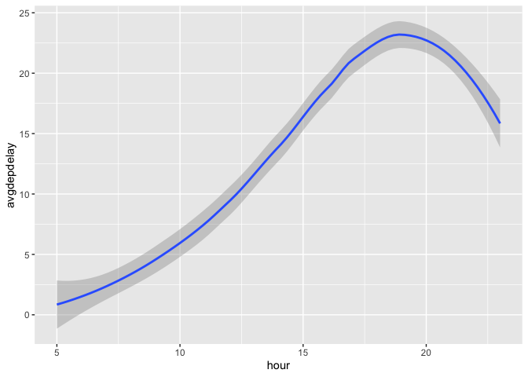

Average delays slowly increase throughout the day, and peak around 7pm
before declining. (This makes sense, in that delays tend to stack up
over time.)

**4. What happens if you supply a negative `n` to `slice_min()` and
friends?**

The `slice_min` function will sort/arrange the observations in the
intended order (in this case: ascending), but it won’t actually slice
anything off because it can’t slice a negative number. The similar holds
true for `slice_max` (where observations are sorted in descending
order).

**5. Explain what `count()` does in terms of the dplyr verbs you just
learned. What does the `sort` argument to `count()` do?**

This is simple: `count()` simply counts observations in a given group.
Including the `sort = TRUE` argument will sort the counts in descending
order.

**6. Suppose we have the following dataframe: follow the instructions.**

    df <- tibble(
      x = 1:5,
      y = c("a", "b", "a", "a", "b"),
      z = c("K", "K", "L", "L", "K")
    )

**6a.**

This code will group by y. The tibble shows the groupings but we haven’t
done anything with the two groups.

    df |>
      group_by(y)

    ## # A tibble: 5 × 3
    ## # Groups:   y [2]
    ##       x y     z    
    ##   <int> <chr> <chr>
    ## 1     1 a     K    
    ## 2     2 b     K    
    ## 3     3 a     L    
    ## 4     4 a     L    
    ## 5     5 b     K

**6b.**

This code will arrange y in ascending order.

    df |>
      arrange(y)

    ## # A tibble: 5 × 3
    ##       x y     z    
    ##   <int> <chr> <chr>
    ## 1     1 a     K    
    ## 2     3 a     L    
    ## 3     4 a     L    
    ## 4     2 b     K    
    ## 5     5 b     K

**6c.**

This code will show the mean of x for each value of y: a, b.

    df |>
      group_by(y) |>
      summarize(mean_x = mean(x))

    ## # A tibble: 2 × 2
    ##   y     mean_x
    ##   <chr>  <dbl>
    ## 1 a       2.67
    ## 2 b       3.5

**6d.**

This code will group by y, then z, and then summarize the means of x
within each combined grouping.

    df |>
      group_by(y, z) |>
      summarize(mean_x = mean(x))

    ## `summarise()` has grouped output by 'y'. You can override using the `.groups`
    ## argument.

    ## # A tibble: 3 × 3
    ## # Groups:   y [2]
    ##   y     z     mean_x
    ##   <chr> <chr>  <dbl>
    ## 1 a     K        1  
    ## 2 a     L        3.5
    ## 3 b     K        3.5

**6e.**

This code will look almost the same as the one above, but a close
inspection will show that the groups have been dropped after analysis.

    df |>
      group_by(y, z) |>
      summarize(mean_x = mean(x), .groups = "drop")

    ## # A tibble: 3 × 3
    ##   y     z     mean_x
    ##   <chr> <chr>  <dbl>
    ## 1 a     K        1  
    ## 2 a     L        3.5
    ## 3 b     K        3.5

**6f.**

Summarize merely shows the mean values by group – it does not show other
values, nor does it insert a new variable into the dataframe.

Mutate will perform similar calculations but maintains each individual
observation and adds a new variable to the dataframe.

    df |>
      group_by(y, z) |>
      summarize(mean_x = mean(x))

    ## `summarise()` has grouped output by 'y'. You can override using the `.groups`
    ## argument.

    ## # A tibble: 3 × 3
    ## # Groups:   y [2]
    ##   y     z     mean_x
    ##   <chr> <chr>  <dbl>
    ## 1 a     K        1  
    ## 2 a     L        3.5
    ## 3 b     K        3.5

    df |>
      group_by(y, z) |>
      mutate(mean_x = mean(x))

    ## # A tibble: 5 × 4
    ## # Groups:   y, z [3]
    ##       x y     z     mean_x
    ##   <int> <chr> <chr>  <dbl>
    ## 1     1 a     K        1  
    ## 2     2 b     K        3.5
    ## 3     3 a     L        3.5
    ## 4     4 a     L        3.5
    ## 5     5 b     K        3.5

# 4. Workflow: code style

## 4.6 Exercises

**1. Fix this nightmare code.**

    flights|>filter(dest=="IAH")|>group_by(year,month,day)|>summarize(n=n(),
    delay=mean(arr_delay,na.rm=TRUE))|>filter(n>10)

    flights|>filter(carrier=="UA",dest%in%c("IAH","HOU"),sched_dep_time>
    0900,sched_arr_time<2000)|>group_by(flight)|>summarize(delay=mean(
    arr_delay,na.rm=TRUE),cancelled=sum(is.na(arr_delay)),n=n())|>filter(n>10)

Here’s the tidy code:

    flights |>
      filter(dest == "IAH") |>
      group_by(year, month, day) |>
      summarize(
        n = n(),
        delay = mean(arr_delay,na.rm=TRUE)
        ) |> 
      filter(n>10)

    ## `summarise()` has grouped output by 'year', 'month'. You can override using the
    ## `.groups` argument.

    ## # A tibble: 365 × 5
    ## # Groups:   year, month [12]
    ##     year month   day     n delay
    ##    <int> <int> <int> <int> <dbl>
    ##  1  2013     1     1    20 17.8 
    ##  2  2013     1     2    20  7   
    ##  3  2013     1     3    19 18.3 
    ##  4  2013     1     4    20 -3.2 
    ##  5  2013     1     5    13 20.2 
    ##  6  2013     1     6    18  9.28
    ##  7  2013     1     7    19 -7.74
    ##  8  2013     1     8    19  7.79
    ##  9  2013     1     9    19 18.1 
    ## 10  2013     1    10    19  6.68
    ## # ℹ 355 more rows

    flights |> 
      filter(
        carrier == "UA",
        dest %in% c("IAH","HOU"),
        sched_dep_time > 0900,
        sched_arr_time < 2000
        ) |>
      group_by(flight) |>
      summarize(
        delay = mean(arr_delay,na.rm=TRUE),
        cancelled = sum(is.na(arr_delay)),n=n()) |>
      filter(n>10)

    ## # A tibble: 74 × 4
    ##    flight delay cancelled     n
    ##     <int> <dbl>     <int> <int>
    ##  1     53 12.5          2    18
    ##  2    112 14.1          0    14
    ##  3    205 -1.71         0    14
    ##  4    235 -5.36         0    14
    ##  5    255 -9.47         0    15
    ##  6    268 38.6          1    15
    ##  7    292  6.57         0    21
    ##  8    318 10.7          1    20
    ##  9    337 20.1          2    21
    ## 10    370 17.5          0    11
    ## # ℹ 64 more rows

# 5 Data tidying

## 5.2.1 Exercises

**(1. This question omitted, as it seems far too self explanatory to
analyze here.)**

You either know how to look at a table and make sense of its structure,
or you do not.

**2. Reshape `table2` to make it tidy, and do the same for `table3`.
(The question asks for a conceptual sketch but I found it easier just to
do the pivoting and transforms vs writing about how I’d do the same
thing.)**

    table2 |>
      pivot_wider(
        names_from = type,
        values_from = count
      ) |> 
      mutate(rate = cases / population * 10000)

    ## # A tibble: 6 × 5
    ##   country      year  cases population  rate
    ##   <chr>       <dbl>  <dbl>      <dbl> <dbl>
    ## 1 Afghanistan  1999    745   19987071 0.373
    ## 2 Afghanistan  2000   2666   20595360 1.29 
    ## 3 Brazil       1999  37737  172006362 2.19 
    ## 4 Brazil       2000  80488  174504898 4.61 
    ## 5 China        1999 212258 1272915272 1.67 
    ## 6 China        2000 213766 1280428583 1.67

    table3 |>
      separate_wider_delim(
        cols = rate, 
        delim = "/", 
        names = c("cases", "population"),
      ) |>
      mutate(
        cases = as.numeric(cases),
        population = as.numeric(population),
        rate = cases / population * 10000
      )

    ## # A tibble: 6 × 5
    ##   country      year  cases population  rate
    ##   <chr>       <dbl>  <dbl>      <dbl> <dbl>
    ## 1 Afghanistan  1999    745   19987071 0.373
    ## 2 Afghanistan  2000   2666   20595360 1.29 
    ## 3 Brazil       1999  37737  172006362 2.19 
    ## 4 Brazil       2000  80488  174504898 4.61 
    ## 5 China        1999 212258 1272915272 1.67 
    ## 6 China        2000 213766 1280428583 1.67

# 6. Workflow: scripts and projects

There are no exercises of note here.

# 7. Data import

Fun way to bring in data from the web. You can use a web address in
place of the relative path on a local machine!

    students <- read_csv("https://pos.it/r4ds-students-csv", na = c("N/A", ""))

    ## Rows: 6 Columns: 5
    ## ── Column specification ────────────────────────────────────────────────────────
    ## Delimiter: ","
    ## chr (4): Full Name, favourite.food, mealPlan, AGE
    ## dbl (1): Student ID
    ## 
    ## ℹ Use `spec()` to retrieve the full column specification for this data.
    ## ℹ Specify the column types or set `show_col_types = FALSE` to quiet this message.

    #clean variable names in a single command!
    students |> janitor::clean_names()

    ## # A tibble: 6 × 5
    ##   student_id full_name        favourite_food     meal_plan           age  
    ##        <dbl> <chr>            <chr>              <chr>               <chr>
    ## 1          1 Sunil Huffmann   Strawberry yoghurt Lunch only          4    
    ## 2          2 Barclay Lynn     French fries       Lunch only          5    
    ## 3          3 Jayendra Lyne    <NA>               Breakfast and lunch 7    
    ## 4          4 Leon Rossini     Anchovies          Lunch only          <NA> 
    ## 5          5 Chidiegwu Dunkel Pizza              Breakfast and lunch five 
    ## 6          6 Güvenç Attila    Ice cream          Lunch only          6

## 7.2.4 Exercises

**1. What function would you use to read a file where fields were
separated with “|”?**

I’d use `read_delim()` since it can handle any defined delimiter.

**2. Apart from `file`, `skip` and `comment`, what other arguments do
`read_csv()` and `read_tsv()` have in common?**

All of them. As the help notes, both functions are special cases of the
more general `read_delim()` function.

**3. What is the most important set of arguments for `read_fwf`?**

In general, any argument that doesn’t have a default value in the
function will be critical – because without it being specified, the
function cannot operate. In the case of `read_fwf()` the following
arguments are required: file, col\_positions. It’s critical to have
these two arguments correctly specified.

**4. To read the following text into a data frame, what argument to
`read_csv()` do you need to specify?**

`"x,y\n1,'a,b'"`

    df <- read_csv("x,y\n1,'a,b'", quote = "'")

    ## Rows: 1 Columns: 2
    ## ── Column specification ────────────────────────────────────────────────────────
    ## Delimiter: ","
    ## chr (1): y
    ## dbl (1): x
    ## 
    ## ℹ Use `spec()` to retrieve the full column specification for this data.
    ## ℹ Specify the column types or set `show_col_types = FALSE` to quiet this message.

**5. Identify what is wrong with each of the inline CSV files.**

    read_csv("a,b\n1,2,3\n4,5,6")
    read_csv("a,b,c\n1,2\n1,2,3,4")
    read_csv("a,b\n\"1")
    read_csv("a,b\n1,2\na,b")
    read_csv("a;b\n1;3")

Line 1: two column headers, three values in each row. Line 2: three
column headers, two values row 2, four values row 3. Line 3: no rows are
read in Line 4: mixes numericacl and text, variables set to character as
a result. Line 5: ; isn’t a named delimiter so we get one column with
one observation.

**6. Practice referring to non-syntactic names.**

    annoying <- tibble(
      `1` = 1:10,
      `2` = `1` * 2 + rnorm(length(`1`))
    )

1.  Extracting the variable called 1

<!-- -->

    annoying |> 
      select(`1`)

    ## # A tibble: 10 × 1
    ##      `1`
    ##    <int>
    ##  1     1
    ##  2     2
    ##  3     3
    ##  4     4
    ##  5     5
    ##  6     6
    ##  7     7
    ##  8     8
    ##  9     9
    ## 10    10

1.  Plotting 1 vs 2

<!-- -->

    ggplot(annoying, aes(x = `1`, y = `2`)) +
      geom_point()

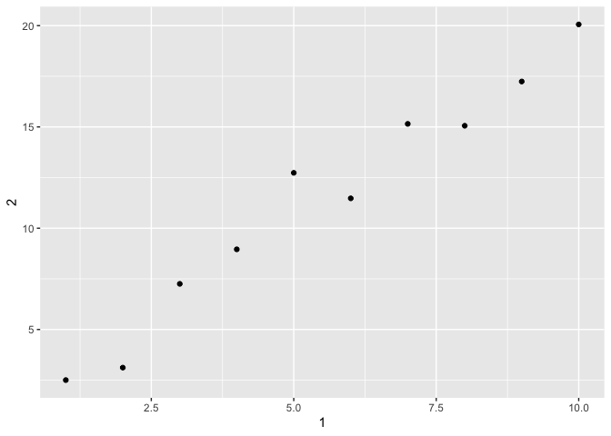

1.  Create a new column called 3, which is 2/1

<!-- -->

    annoying |> 
      mutate(`3` = `2` / `1`)

    ## # A tibble: 10 × 3
    ##      `1`   `2`   `3`
    ##    <int> <dbl> <dbl>
    ##  1     1  2.50  2.50
    ##  2     2  3.12  1.56
    ##  3     3  7.25  2.42
    ##  4     4  8.96  2.24
    ##  5     5 12.7   2.55
    ##  6     6 11.5   1.91
    ##  7     7 15.2   2.16
    ##  8     8 15.1   1.88
    ##  9     9 17.2   1.92
    ## 10    10 20.1   2.01

1.  Renaming columns to one, two and three

<!-- -->

    annoying |> 
      mutate(`3` = `2` / `1`) |> 
      rename(
        "one" = `1`,
        "two" = `2`,
        "three" = `3`
      )

    ## # A tibble: 10 × 3
    ##      one   two three
    ##    <int> <dbl> <dbl>
    ##  1     1  2.50  2.50
    ##  2     2  3.12  1.56
    ##  3     3  7.25  2.42
    ##  4     4  8.96  2.24
    ##  5     5 12.7   2.55
    ##  6     6 11.5   1.91
    ##  7     7 15.2   2.16
    ##  8     8 15.1   1.88
    ##  9     9 17.2   1.92
    ## 10    10 20.1   2.01

# 8. Workflow: getting help

There are no exercises of note here.
