# 12. Logical vectors

## 12.2.4 Exercises

**1. How does dplyr::near() work? Type near to see the source code. Is sqrt(2)^2 near 2?**

The function specifies a tolerance value, and then compares the two values to determine if the difference is within the specified tolerance.

``` r
near(2, sqrt(2)^2)
```

    ## [1] TRUE

Yes, sqrt(2)^2 is near 2.

**2. Use mutate(), is.na(), and count() together to describe how the missing values in dep_time, sched_dep_time and dep_delay are connected.**

Without even looking, I’d expect that `sched_dep_time` - `dep_time` = `dep_delay` which would mean if either `sched_dep_time` or `dep_time` are recorded as NA, then `dep_delay` will also be NA.

``` r
flights |> 
  mutate(
    dep_time_missing = is.na(dep_time),
    sched_dep_time_missing = is.na(sched_dep_time),
    dep_delay_missing = is.na(dep_delay)
  ) |> 
  count(dep_time_missing, sched_dep_time_missing, dep_delay_missing)
```

    ## # A tibble: 2 × 4
    ##   dep_time_missing sched_dep_time_missing dep_delay_missing      n
    ##   <lgl>            <lgl>                  <lgl>              <int>
    ## 1 FALSE            FALSE                  FALSE             328521
    ## 2 TRUE             FALSE                  TRUE                8255

I was correct. Based on the data, `sched_dep_time` is never missing in this data. But whenever `dep_time` is missing, corresponding with a cancelled flight, so too is `dep_delay` missing. In this case, 8,255 flights were cancelled in this data set.

## 12.3.4 Exercises

**1. Find all flights where arr_delay is missing but dep_delay is not. Find all flights where neither arr_time nor sched_arr_time are missing, but arr_delay is.**

``` r
flights |> 
  filter(is.na(arr_delay) & !is.na(dep_delay))
```

    ## # A tibble: 1,175 × 19
    ##     year month   day dep_time sched_dep_time dep_delay arr_time sched_arr_time
    ##    <int> <int> <int>    <int>          <int>     <dbl>    <int>          <int>
    ##  1  2013     1     1     1525           1530        -5     1934           1805
    ##  2  2013     1     1     1528           1459        29     2002           1647
    ##  3  2013     1     1     1740           1745        -5     2158           2020
    ##  4  2013     1     1     1807           1738        29     2251           2103
    ##  5  2013     1     1     1939           1840        59       29           2151
    ##  6  2013     1     1     1952           1930        22     2358           2207
    ##  7  2013     1     1     2016           1930        46       NA           2220
    ##  8  2013     1     2      905            822        43     1313           1045
    ##  9  2013     1     2     1125            925       120     1445           1146
    ## 10  2013     1     2     1848           1840         8     2333           2151
    ## # ℹ 1,165 more rows
    ## # ℹ 11 more variables: arr_delay <dbl>, carrier <chr>, flight <int>,
    ## #   tailnum <chr>, origin <chr>, dest <chr>, air_time <dbl>, distance <dbl>,
    ## #   hour <dbl>, minute <dbl>, time_hour <dttm>

``` r
flights |> 
  filter(!is.na(arr_time) & !is.na(sched_arr_time)) |> 
  filter(is.na(arr_delay))
```

    ## # A tibble: 717 × 19
    ##     year month   day dep_time sched_dep_time dep_delay arr_time sched_arr_time
    ##    <int> <int> <int>    <int>          <int>     <dbl>    <int>          <int>
    ##  1  2013     1     1     1525           1530        -5     1934           1805
    ##  2  2013     1     1     1528           1459        29     2002           1647
    ##  3  2013     1     1     1740           1745        -5     2158           2020
    ##  4  2013     1     1     1807           1738        29     2251           2103
    ##  5  2013     1     1     1939           1840        59       29           2151
    ##  6  2013     1     1     1952           1930        22     2358           2207
    ##  7  2013     1     2      905            822        43     1313           1045
    ##  8  2013     1     2     1125            925       120     1445           1146
    ##  9  2013     1     2     1848           1840         8     2333           2151
    ## 10  2013     1     2     1849           1724        85     2235           1938
    ## # ℹ 707 more rows
    ## # ℹ 11 more variables: arr_delay <dbl>, carrier <chr>, flight <int>,
    ## #   tailnum <chr>, origin <chr>, dest <chr>, air_time <dbl>, distance <dbl>,
    ## #   hour <dbl>, minute <dbl>, time_hour <dttm>

**2. How many flights have a missing dep_time? What other variables are missing in these rows? What might these rows represent?**

``` r
flights |> 
  filter(is.na(dep_time))
```

    ## # A tibble: 8,255 × 19
    ##     year month   day dep_time sched_dep_time dep_delay arr_time sched_arr_time
    ##    <int> <int> <int>    <int>          <int>     <dbl>    <int>          <int>
    ##  1  2013     1     1       NA           1630        NA       NA           1815
    ##  2  2013     1     1       NA           1935        NA       NA           2240
    ##  3  2013     1     1       NA           1500        NA       NA           1825
    ##  4  2013     1     1       NA            600        NA       NA            901
    ##  5  2013     1     2       NA           1540        NA       NA           1747
    ##  6  2013     1     2       NA           1620        NA       NA           1746
    ##  7  2013     1     2       NA           1355        NA       NA           1459
    ##  8  2013     1     2       NA           1420        NA       NA           1644
    ##  9  2013     1     2       NA           1321        NA       NA           1536
    ## 10  2013     1     2       NA           1545        NA       NA           1910
    ## # ℹ 8,245 more rows
    ## # ℹ 11 more variables: arr_delay <dbl>, carrier <chr>, flight <int>,
    ## #   tailnum <chr>, origin <chr>, dest <chr>, air_time <dbl>, distance <dbl>,
    ## #   hour <dbl>, minute <dbl>, time_hour <dttm>

8,255 records are missing `dept_time`. When `dep_time` is missing, `dep_delay`, `arr_time` and `arr_delay` are also missing; this makes sense because if a flight doesn’t depart (is NA), there can’t be a departure delay, and there will be no arrival.

**3. Assuming that a missing dep_time implies that a flight is cancelled, look at the number of cancelled flights per day. Is there a pattern? Is there a connection between the proportion of cancelled flights and the average delay of non-cancelled flights?**

``` r
flights |> 
  group_by(hour = sched_dep_time %/% 100) |> 
  summarize(prop_cancelled = mean(is.na(dep_time)), n = n()) |> 
  filter(hour > 1) |> 
  ggplot(aes(x = hour, y = prop_cancelled)) +
  geom_line(color = "grey50") + 
  geom_point(aes(size = n))
```

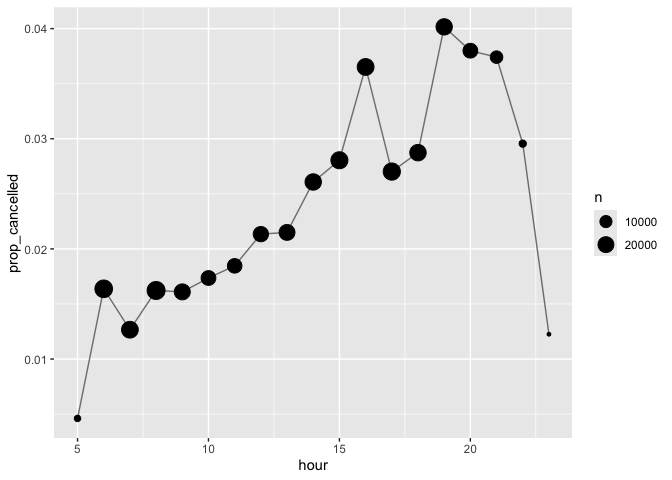<!-- -->

## 12.4.4 Exercises

**1. What will sum(is.na(x)) tell you? How about mean(is.na(x))?**

`sum(is.na(x))` will provide a count of all rows where NA’s appear; `mean(is.na(x))` will provide a proportional value vs all records.

**2. What does prod() return when applied to a logical vector? What logical summary function is it equivalent to? What does min() return when applied to a logical vector? What logical summary function is it equivalent to? Read the documentation and perform a few experiments.**

The `prod()` function will simply take the product of 0 and 1 values in the logical vector (or NAs). It’s effectively a way to ask if everything in the vector is true (=1). It’s the same thing as `all()`.

The `min()` function will look at the 0 and 1 values in the logical vector. If any of them are 0, it returns FALSE; otherwise, it returns TRUE (since everything =1, and the min therefore is =1). It’s the same thing as `any()`.

No experiments necessary for this one, sorry not sorry.

## 12.5.4 Exercises

**1. A number is even if it’s divisible by two, which in R you can find out with x %% 2 == 0. Use this fact and if_else() to determine whether each number between 0 and 20 is even or odd. **

``` r
x <- c(0:20)

if_else(x %% 2 == 0, "even", "odd")
```

    ##  [1] "even" "odd"  "even" "odd"  "even" "odd"  "even" "odd"  "even" "odd" 
    ## [11] "even" "odd"  "even" "odd"  "even" "odd"  "even" "odd"  "even" "odd" 
    ## [21] "even"

**2. Given a vector of days like x \<- c(“Monday”, “Saturday”, “Wednesday”), use an if_else() statement to label them as weekends or weekdays.**

Can’t even be bothered to write the entire vector as part of the question, eh? (Alllllllllllrighty, then.)

``` r
days <- c("Monday", "Tuesday", "Wednesday", "Thursday", "Friday", "Saturday", "Sunday")

if_else(days %in% c("Saturday", "Sunday"), "weekend", "weekdays")
```

    ## [1] "weekdays" "weekdays" "weekdays" "weekdays" "weekdays" "weekend"  "weekend"

**3. Use if_else() to compute the absolute value of a numeric vector called x.**

Again, the question can’t be bothered to actually give us a numeric vector to work with…and it’s vague. Why would `if_else()` even be needed to do this? That serves no purpose and would never be done in the real world.

``` r
x <- c(-345:345)

y <- abs(x)
head(y)
```

    ## [1] 345 344 343 342 341 340

**4. Write a case_when() statement that uses the month and day columns from flights to label a selection of important US holidays (e.g., New Years Day, 4th of July, Thanksgiving, and Christmas). First create a logical column that is either TRUE or FALSE, and then create a character column that either gives the name of the holiday or is NA.**

``` r
flights |> 
  mutate(
    holiday = case_when(
      (month = 1) & (day = 1) ~ "New Years Day",
      (month = 7) & (day =4) ~ "Independence Day",
      (month = 11) & (day = 23) ~ "Thanksgiving Day",
      (month - 12) & (day = 25) ~ "Christmas Day"
    )
  ) |> 
  relocate(holiday)
```

    ## # A tibble: 336,776 × 20
    ##    holiday        year month   day dep_time sched_dep_time dep_delay arr_time
    ##    <chr>         <int> <int> <int>    <int>          <int>     <dbl>    <int>
    ##  1 New Years Day  2013     1     1      517            515         2      830
    ##  2 New Years Day  2013     1     1      533            529         4      850
    ##  3 New Years Day  2013     1     1      542            540         2      923
    ##  4 New Years Day  2013     1     1      544            545        -1     1004
    ##  5 New Years Day  2013     1     1      554            600        -6      812
    ##  6 New Years Day  2013     1     1      554            558        -4      740
    ##  7 New Years Day  2013     1     1      555            600        -5      913
    ##  8 New Years Day  2013     1     1      557            600        -3      709
    ##  9 New Years Day  2013     1     1      557            600        -3      838
    ## 10 New Years Day  2013     1     1      558            600        -2      753
    ## # ℹ 336,766 more rows
    ## # ℹ 12 more variables: sched_arr_time <int>, arr_delay <dbl>, carrier <chr>,
    ## #   flight <int>, tailnum <chr>, origin <chr>, dest <chr>, air_time <dbl>,
    ## #   distance <dbl>, hour <dbl>, minute <dbl>, time_hour <dttm>

# 13. Numbers

## 13.3.1 Exercises

**1. How can you use count() to count the number of rows with a missing value for a given variable?**

That’s as simple as using `count(is.na(x))` where `x` is the variable of interest. The output will give you a counting summary of `TRUE` and `FALSE` variables, where `TRUE` represents the number of rows with a missing value for the given variable.

**2. Expand the following calls to count() to instead use group_by(), summarize(), and arrange().**

``` r
flights |> count(dest, sort = TRUE)

flights |> count(tailnum, wt = distance)
```

Expanding, the code is less efficient and looks like this:

``` r
flights |>
  group_by(dest) |>
  summarize(n = n()) |>
  arrange(desc(n))
```

    ## # A tibble: 105 × 2
    ##    dest      n
    ##    <chr> <int>
    ##  1 ORD   17283
    ##  2 ATL   17215
    ##  3 LAX   16174
    ##  4 BOS   15508
    ##  5 MCO   14082
    ##  6 CLT   14064
    ##  7 SFO   13331
    ##  8 FLL   12055
    ##  9 MIA   11728
    ## 10 DCA    9705
    ## # ℹ 95 more rows

``` r
flights |>
  group_by(tailnum) |>
  summarize(n = sum(distance, na.rm = TRUE)) |>
  arrange(desc(n))
```

    ## # A tibble: 4,044 × 2
    ##    tailnum       n
    ##    <chr>     <dbl>
    ##  1 <NA>    1784167
    ##  2 N328AA   939101
    ##  3 N338AA   931183
    ##  4 N327AA   915665
    ##  5 N335AA   909696
    ##  6 N323AA   844529
    ##  7 N319AA   840510
    ##  8 N336AA   838086
    ##  9 N329AA   830776
    ## 10 N324AA   794895
    ## # ℹ 4,034 more rows

## 13.4.8 Exercises

**1. Explain in words what each line of the code used to generate Figure 13.1 does**

In order by line: \* pipe the flights data frame \* use `%/%` to extract the hour (as a multiple of 100), and use the hour to group the data \* pipe into the `summarize()` function, with 2 arguments: a proportation of cancellations/all flights, and a count of flights \* pipe into a filter so that we only work with hours \> 1 going forward \* pipe into `ggplot()` to visualize the data, setting the x and y axes \* pipe into geometric layer for the plot, using a line \* pipe into geometric layer for the plot, using a point that sizes based on n (# of observations)

``` r
flights |> 
  group_by(hour = sched_dep_time %/% 100) |> 
  summarize(prop_cancelled = mean(is.na(dep_time)), n = n()) |> 
  filter(hour > 1) |> 
  ggplot(aes(x = hour, y = prop_cancelled)) +
  geom_line(color = "grey50") + 
  geom_point(aes(size = n))
```

**2. What trigonometric functions does R provide? Guess some names and look up the documentation. Do they use degrees or radians?**

cos(x) sin(x) tan(x)

acos(x) asin(x) atan(x) atan2(y, x)

cospi(x) sinpi(x) tanpi(x)

Angles are in radians, not degrees.

**3. Currently dep_time and sched_dep_time are convenient to look at, but hard to compute with because they’re not really continuous numbers. You can see the basic problem by running the code below: there’s a gap between each hour.**

``` r
flights |> 
  filter(month == 1, day == 1) |> 
  ggplot(aes(x = sched_dep_time, y = dep_delay)) +
  geom_point()
```

    ## Warning: Removed 4 rows containing missing values or values outside the scale range
    ## (`geom_point()`).

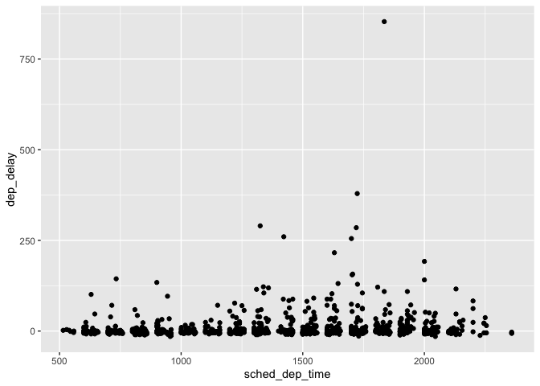<!-- -->

**Convert them to a more truthful representation of time (either fractional hours or minutes since midnight).**

``` r
flights |> 
  mutate(
    sched_dep_hour = sched_dep_time %/% 100 + (sched_dep_time %% 100) / 60,
    dep_hour = dep_time %/% 100 + (dep_time %% 100) / 60
  ) |>
  filter(month == 1, day == 1) |> 
  ggplot(aes(x = sched_dep_hour, y = dep_delay)) +
  geom_point()
```

    ## Warning: Removed 4 rows containing missing values or values outside the scale range
    ## (`geom_point()`).

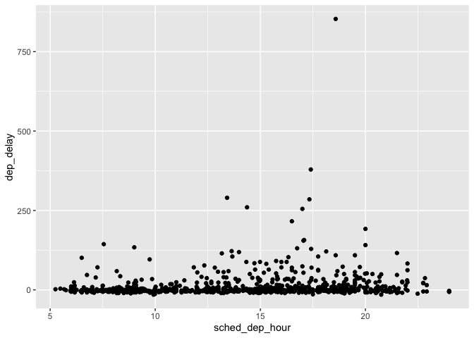<!-- -->

**4. Round dep_time and arr_time to the nearest five minutes.**

``` r
flights |> 
  mutate(
    # Convert dep_time and arr_time to minutes since midnight
    dep_time_min = (dep_time %/% 100) * 60 + (dep_time %% 100),
    arr_time_min = (arr_time %/% 100) * 60 + (arr_time %% 100),
    
    # Round to the nearest 5 minutes
    dep_time_min = round(dep_time_min / 5) * 5,
    arr_time_min = round(arr_time_min / 5) * 5,
    
    # Convert back to HHMM format
    dep_time_rounded = (dep_time_min %/% 60) * 100 + (dep_time_min %% 60),
    arr_time_rounded = (arr_time_min %/% 60) * 100 + (arr_time_min %% 60)
  ) |>
  select(dep_time, dep_time_rounded, arr_time, arr_time_rounded) |> 
  head()
```

    ## # A tibble: 6 × 4
    ##   dep_time dep_time_rounded arr_time arr_time_rounded
    ##      <int>            <dbl>    <int>            <dbl>
    ## 1      517              515      830              830
    ## 2      533              535      850              850
    ## 3      542              540      923              925
    ## 4      544              545     1004             1005
    ## 5      554              555      812              810
    ## 6      554              555      740              740

## 13.5.4 Exercises

**1. Find the 10 most delayed flights using a ranking function. How do you want to handle ties? Carefully read the documentation for min_rank(). **

``` r
most_delayed_flights <- flights |>
  mutate(rank = min_rank(desc(arr_delay))) |>  # Rank by descending arrival delay
  filter(rank <= 10) |>
  arrange(rank)

most_delayed_flights |> 
  select(year, month, day, dep_time, sched_dep_time, arr_delay, rank)
```

    ## # A tibble: 10 × 7
    ##     year month   day dep_time sched_dep_time arr_delay  rank
    ##    <int> <int> <int>    <int>          <int>     <dbl> <int>
    ##  1  2013     1     9      641            900      1272     1
    ##  2  2013     6    15     1432           1935      1127     2
    ##  3  2013     1    10     1121           1635      1109     3
    ##  4  2013     9    20     1139           1845      1007     4
    ##  5  2013     7    22      845           1600       989     5
    ##  6  2013     4    10     1100           1900       931     6
    ##  7  2013     3    17     2321            810       915     7
    ##  8  2013     7    22     2257            759       895     8
    ##  9  2013    12     5      756           1700       878     9
    ## 10  2013     5     3     1133           2055       875    10

**2. Which plane (tailnum) has the worst on-time record? **

``` r
worst_plane <- flights |> 
  group_by(tailnum) |> 
  summarize(avg_arr_delay = mean(arr_delay, na.rm = TRUE), n = n()) |> 
  arrange(desc(avg_arr_delay)) |> 
  slice(1)

worst_plane
```

    ## # A tibble: 1 × 3
    ##   tailnum avg_arr_delay     n
    ##   <chr>           <dbl> <int>
    ## 1 N844MH            320     1

The worst plane has only one flight. We might want to only look at planes that have flown “enough,” which we can define as 30 or more flights.

``` r
worst_plane_sampled <- flights |> 
  group_by(tailnum) |> 
  summarize(avg_arr_delay = mean(arr_delay, na.rm = TRUE), n = n()) |>
  filter(n > 30) |> 
  arrange(desc(avg_arr_delay)) |> 
  slice(1)

worst_plane_sampled
```

    ## # A tibble: 1 × 3
    ##   tailnum avg_arr_delay     n
    ##   <chr>           <dbl> <int>
    ## 1 N203FR           59.1    41

**3. What time of day should you fly if you want to avoid delays as much as possible? **

To answer this, first we get the average delay by hour; then we find the hour with the minimum average delay.

``` r
# Convert scheduled departure time to hours and calculate average delay by hour
delay_by_hour <- flights |>
  mutate(
    sched_hour = sched_dep_time %/% 100 + (sched_dep_time %% 100) / 60
  ) |>
  group_by(sched_hour) |>
  summarize(avg_dep_delay = mean(dep_delay, na.rm = TRUE), n = n()) |>
  arrange(avg_dep_delay)

# Find the hour with the minimum average delay
min_delay_hour <- delay_by_hour |>
  filter(avg_dep_delay == min(avg_dep_delay, na.rm = TRUE)) |>
  select(sched_hour, avg_dep_delay)

min_delay_hour
```

    ## # A tibble: 1 × 2
    ##   sched_hour avg_dep_delay
    ##        <dbl>         <dbl>
    ## 1       22.0            -7

You’d want to be flying later at night to minimize delays, which is in line with a similar analysis in an earlier homework question that charted average delay by hour of the day.

**4. What does flights \|\> group_by(dest) \|\> filter(row_number() \< 4) do? What does flights \|\> group_by(dest) \|\> filter(row_number(dep_delay) \< 4) do? **

Let’s find out, shall we?

``` r
flights |> 
  group_by(dest) |> 
  filter(row_number() < 4)
```

    ## # A tibble: 311 × 19
    ## # Groups:   dest [105]
    ##     year month   day dep_time sched_dep_time dep_delay arr_time sched_arr_time
    ##    <int> <int> <int>    <int>          <int>     <dbl>    <int>          <int>
    ##  1  2013     1     1      517            515         2      830            819
    ##  2  2013     1     1      533            529         4      850            830
    ##  3  2013     1     1      542            540         2      923            850
    ##  4  2013     1     1      544            545        -1     1004           1022
    ##  5  2013     1     1      554            600        -6      812            837
    ##  6  2013     1     1      554            558        -4      740            728
    ##  7  2013     1     1      555            600        -5      913            854
    ##  8  2013     1     1      557            600        -3      709            723
    ##  9  2013     1     1      557            600        -3      838            846
    ## 10  2013     1     1      558            600        -2      753            745
    ## # ℹ 301 more rows
    ## # ℹ 11 more variables: arr_delay <dbl>, carrier <chr>, flight <int>,
    ## #   tailnum <chr>, origin <chr>, dest <chr>, air_time <dbl>, distance <dbl>,
    ## #   hour <dbl>, minute <dbl>, time_hour <dttm>

``` r
flights |> 
  group_by(dest) |> 
  filter(row_number(dep_delay) < 4)
```

    ## # A tibble: 310 × 19
    ## # Groups:   dest [104]
    ##     year month   day dep_time sched_dep_time dep_delay arr_time sched_arr_time
    ##    <int> <int> <int>    <int>          <int>     <dbl>    <int>          <int>
    ##  1  2013     1     1      848            851        -3     1155           1136
    ##  2  2013     1     1      946            959       -13     1146           1202
    ##  3  2013     1     4     2140           2159       -19     2241           2316
    ##  4  2013     1     5      859            901        -2     1144           1201
    ##  5  2013     1     5     2143           2159       -16     2257           2315
    ##  6  2013     1     7     1801           1810        -9     2116           2142
    ##  7  2013     1     7     2013           2030       -17     2150           2206
    ##  8  2013     1     8      735            750       -15      912            940
    ##  9  2013     1     9     1847           1858       -11     2024           2055
    ## 10  2013     1    10      810            827       -17      955           1031
    ## # ℹ 300 more rows
    ## # ℹ 11 more variables: arr_delay <dbl>, carrier <chr>, flight <int>,
    ## #   tailnum <chr>, origin <chr>, dest <chr>, air_time <dbl>, distance <dbl>,
    ## #   hour <dbl>, minute <dbl>, time_hour <dttm>

The first code take the first 3 rows of each grouped destination, as they appear in the data. The second code also takes the first three rows, but after first sorting the data by `dep_delay`. Unless the data is already sorted in such a manner, the two code sets will derive very different outputs.

**5. For each destination, compute the total minutes of delay. For each flight, compute the proportion of the total delay for its destination. **

``` r
#part a
flights_with_total_delay <- flights |>
  group_by(dest) |>
  mutate(total_dest_delay = sum(arr_delay, na.rm = TRUE)) |> 
  relocate(dest) |> 
  relocate(total_dest_delay)

head(flights_with_total_delay)
```

    ## # A tibble: 6 × 20
    ## # Groups:   dest [5]
    ##   total_dest_delay dest   year month   day dep_time sched_dep_time dep_delay
    ##              <dbl> <chr> <int> <int> <int>    <int>          <int>     <dbl>
    ## 1            30046 IAH    2013     1     1      517            515         2
    ## 2            30046 IAH    2013     1     1      533            529         4
    ## 3             3467 MIA    2013     1     1      542            540         2
    ## 4             7322 BQN    2013     1     1      544            545        -1
    ## 5           190260 ATL    2013     1     1      554            600        -6
    ## 6            97352 ORD    2013     1     1      554            558        -4
    ## # ℹ 12 more variables: arr_time <int>, sched_arr_time <int>, arr_delay <dbl>,
    ## #   carrier <chr>, flight <int>, tailnum <chr>, origin <chr>, air_time <dbl>,
    ## #   distance <dbl>, hour <dbl>, minute <dbl>, time_hour <dttm>

``` r
# part b: compute the proportion of the total delay for each flight
flights_with_proportion <- flights_with_total_delay |>
  mutate(proportion_of_delay = arr_delay / total_dest_delay) |>
  select(flight, dest, arr_delay, total_dest_delay, proportion_of_delay)

head(flights_with_proportion)
```

    ## # A tibble: 6 × 5
    ## # Groups:   dest [5]
    ##   flight dest  arr_delay total_dest_delay proportion_of_delay
    ##    <int> <chr>     <dbl>            <dbl>               <dbl>
    ## 1   1545 IAH          11            30046            0.000366
    ## 2   1714 IAH          20            30046            0.000666
    ## 3   1141 MIA          33             3467            0.00952 
    ## 4    725 BQN         -18             7322           -0.00246 
    ## 5    461 ATL         -25           190260           -0.000131
    ## 6   1696 ORD          12            97352            0.000123

**6. Delays are typically temporally correlated: even once the problem that caused the initial delay has been resolved, later flights are delayed to allow earlier flights to leave. Using lag(), explore how the average flight delay for an hour is related to the average delay for the previous hour. **

``` r
# calculate the average delay for each hour
hourly_delays <- flights |> 
  mutate(hour = dep_time %/% 100) |> 
  group_by(year, month, day, hour) |> 
  summarize(
    dep_delay = mean(dep_delay, na.rm = TRUE),
    n = n(),
    .groups = "drop"
  ) |> 
  filter(n > 5)  # Filter out hours with fewer than 5 flights

# use lag() to get the average delay of the previous hour
hourly_delays <- hourly_delays |> 
  arrange(year, month, day, hour) |>  # Ensure the data is ordered correctly
  mutate(prev_hour_delay = lag(dep_delay))

# analyze the relationship
correlation <- cor(hourly_delays$dep_delay, hourly_delays$prev_hour_delay, use = "complete.obs")

# display the correlation
correlation
```

    ## [1] 0.7565121

**7. Look at each destination. Can you find flights that are suspiciously fast (i.e. flights that represent a potential data entry error)? Compute the air time of a flight relative to the shortest flight to that destination. Which flights were most delayed in the air? **

Let’s start with suspiciously fast flights that might be a data entry error. To perform this analysis I’m looking for flights that were more than 3 standard deviations quicker than the average for a given destination – to account for the fact that some origins are closer to a given destination, I have standardized the air time variable per unit of distance.

The results find 18 flights that appear to be much quicker than would otherwise be expected, and should be looked at further to ensure the accuracy of the data. (NOTE: I don’t see how any of this has anything to do with the section of the text this problem appeared in, but whatever.)

``` r
air_time_stats <- flights |> 
  group_by(dest) |>
  summarize(
    mean_air_time_distance = mean(air_time / distance, na.rm = TRUE), 
    sd_air_time_distance = sd(air_time / distance, na.rm = TRUE)
  )

fast_flights <- flights |>
  left_join(air_time_stats, by = "dest") |>
  mutate(air_time_distance = air_time / distance) |>
  filter(air_time_distance < (mean_air_time_distance - 3 * sd_air_time_distance)) |> 
  relocate(dest, air_time, mean_air_time_distance, sd_air_time_distance, air_time_distance, .before = everything()) |> 
  arrange(dest)
  

fast_flights
```

    ## # A tibble: 18 × 22
    ##    dest  air_time mean_air_time_distance sd_air_time_distance air_time_distance
    ##    <chr>    <dbl>                  <dbl>                <dbl>             <dbl>
    ##  1 ATL         65                  0.149              0.0130             0.0853
    ##  2 BNA         70                  0.151              0.0146             0.0936
    ##  3 BOS         23                  0.204              0.0255             0.125 
    ##  4 BOS         21                  0.204              0.0255             0.114 
    ##  5 BTV         34                  0.175              0.0146             0.128 
    ##  6 BUF         38                  0.188              0.0159             0.126 
    ##  7 CVG         62                  0.167              0.0151             0.109 
    ##  8 GRR         69                  0.160              0.0141             0.114 
    ##  9 GSP         55                  0.157              0.0136             0.0926
    ## 10 MSP         93                  0.148              0.0115             0.0923
    ## 11 ORF         36                  0.180              0.0176             0.124 
    ## 12 ORF         37                  0.180              0.0176             0.125 
    ## 13 PBI        105                  0.141              0.0109             0.101 
    ## 14 PIT         40                  0.184              0.0185             0.119 
    ## 15 RIC         35                  0.192              0.0193             0.126 
    ## 16 ROC         35                  0.192              0.0178             0.133 
    ## 17 SEA        277                  0.136              0.00644            0.115 
    ## 18 SEA        275                  0.136              0.00644            0.114 
    ## # ℹ 17 more variables: year <int>, month <int>, day <int>, dep_time <int>,
    ## #   sched_dep_time <int>, dep_delay <dbl>, arr_time <int>,
    ## #   sched_arr_time <int>, arr_delay <dbl>, carrier <chr>, flight <int>,
    ## #   tailnum <chr>, origin <chr>, distance <dbl>, hour <dbl>, minute <dbl>,
    ## #   time_hour <dttm>

*I know this question asks for two additional analyses, but given that I think they’re kind of repetitive and add nothing significant beyond this initial analysis, I’m going to skip them both. I can do that, since this isn’t actual homework….*

**8. Find all destinations that are flown by at least two carriers. Use those destinations to come up with a relative ranking of the carriers based on their performance for the same destination. **

``` r
good_destinations <- flights |> 
  group_by(dest) |> 
  summarize(
    num_carriers = n_distinct(carrier),
    .groups = "drop"
    ) |> 
  filter(num_carriers >=2)

carrier_perf <- flights |> 
  filter(dest %in% good_destinations$dest) |> 
  group_by(dest, carrier) |> 
  summarize(
    avg_arr_delay = mean(arr_delay, na.rm = TRUE),
    .groups = "drop"
  )

carrier_rank <- carrier_perf |> 
  group_by(dest) |> 
  mutate(rank = rank(avg_arr_delay, ties.method = "min")) |> 
  arrange(dest, rank)

carrier_rank
```

    ## # A tibble: 285 × 4
    ## # Groups:   dest [76]
    ##    dest  carrier avg_arr_delay  rank
    ##    <chr> <chr>           <dbl> <int>
    ##  1 ATL   9E              0.857     1
    ##  2 ATL   WN              6.90      2
    ##  3 ATL   DL              7.42      3
    ##  4 ATL   UA             10.5       4
    ##  5 ATL   MQ             14.0       5
    ##  6 ATL   EV             19.6       6
    ##  7 ATL   FL             20.7       7
    ##  8 AUS   WN            -11.2       1
    ##  9 AUS   9E             -3.5       2
    ## 10 AUS   DL              1.41      3
    ## # ℹ 275 more rows

## 13.6.7 Exercises

**1. Brainstorm at least 5 different ways to assess the typical delay characteristics of a group of flights. When is mean() useful? When is median() useful? When might you want to use something else? Should you use arrival delay or departure delay? Why might you want to use data from planes?**

1.  Mean of arrival delays or departure delays
2.  Median of of arrival or departure delays
3.  Percentage of flights delayed/on-time against some threshold
4.  Proportion of flights delayed within a given hour
5.  Spread of delays by carrier, time, etc.

Let’s talk briefly about arrival vs departure delays, since the question asked. Arrival delays are the “final” word on delays – that is, a departure delay means little if the flight (within tolerances) yet arrives on time to its destination. If we care simply about the punctuality of flights, we care about arrival delays. Departure delays can assess efficiency of ground operations at a given airport (ie, are some airports and/or carriers more likely to experience departure delays vs others?); which are a good tool if an airport or carrier is trying to assess the efficiency of its own operations.

Now, onto using data from `planes`: this is the tailnum for an individual plane. There are absolutely reasons to analyze data by plane: planes that are more likely to experience delays than would be expected may indicate maintenance problems, or other operational issues that need to be addressed. It’s also possible that some planes fly longer distances on average, or fly more challenging routes (ie, more turbulence on average), etc.

**2. Which destinations show the greatest variation in air speed?**

I basically performed a similar analysis earlier, but will repurpose the dataset here to answer this question. Here, I will pull the top 5 destinations that show the greatest variation in air speed.

``` r
air_speed_variation <- flights |> 
  group_by(dest) |>
  summarize(
    sd_air_speed = sd(distance / air_time, na.rm = TRUE)
  ) |> 
  arrange(desc(sd_air_speed)) |> 
  slice_max(sd_air_speed, n = 5)

air_speed_variation
```

    ## # A tibble: 5 × 2
    ##   dest  sd_air_speed
    ##   <chr>        <dbl>
    ## 1 OKC          0.639
    ## 2 TUL          0.624
    ## 3 ILM          0.615
    ## 4 BNA          0.615
    ## 5 CLT          0.611

**3. Create a plot to further explore the adventures of EGE. Can you find any evidence that the airport moved locations? Can you find another variable that might explain the difference? **

``` r
flights_to_EGE <- flights |> 
  filter(dest == "EGE")

ggplot(flights_to_EGE, aes(x = air_time, y = distance, color = carrier)) +
  geom_point() +
  labs(
    title = "American Airlines has a flight in the air a VERY long time",
    x = "Air Time (minutes)",
    y = "Distance (miles)",
    color = "Carrier"
  ) 
```

    ## Warning: Removed 6 rows containing missing values or values outside the scale range
    ## (`geom_point()`).

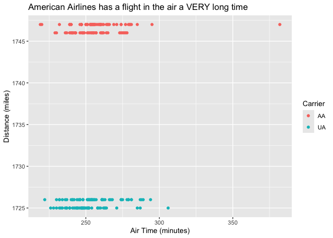<!-- -->

This output suggests there is indeed some differences: in particular, each carrier has split the number of flights to EWE, with some flying longer distances and some shorter. It’s possible the airlines are taking multiple routes, but it would be surprising that this is the ONLY airport that has such a thing taking place in the data.

Let’s dig in and see if there is a change over time in terms of each carrier’s flight distance, as shown in the below plot.

``` r
ggplot(flights |> filter(dest == "EGE"), aes(x = as.Date(time_hour), y = distance, color = carrier)) +
  geom_point(alpha = 0.5) +
  geom_smooth(method = "loess", se = FALSE) +  # Adds a smooth trend line
  labs(
    title = "Distance to EGE Over Time by Carrier",
    x = "Date",
    y = "Distance (miles)",
    color = "Carrier"
  ) +
  theme_minimal() +
  facet_wrap(~ carrier, scales = "free_y")  # Separate plots for each carrier
```

    ## `geom_smooth()` using formula = 'y ~ x'

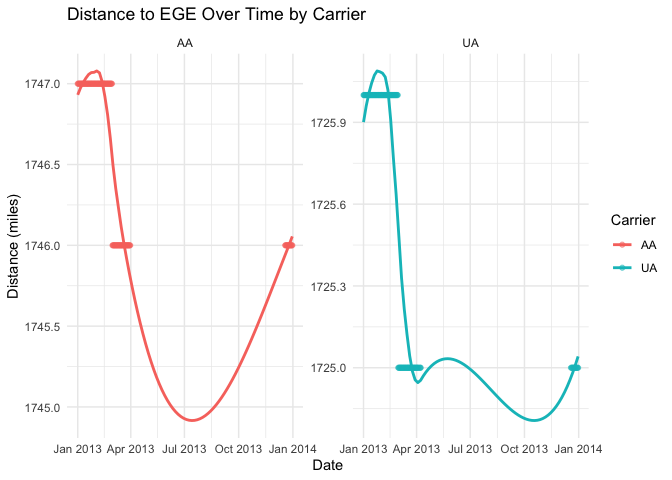<!-- -->

Indeed, there is a change! Notice that all flights from both carriers were flying one distance in early 2013, and after March 2013 – both carriers suddenly began flying a different (shorter) distance for all remaining flights!

This suggests that, oddly enough, the airport likely did move!

# 14. Strings

``` r
library(babynames)
```

## 14.2.4 Exercises

**1. Create strings that contain the following values:**

**He said “That’s amazing!”**

**`\a\b\c\d`**

**`\\\\\\`**

``` r
x <- r"[He said "That's amazing!"]"
y <- r"[\a\b\c\d]"
z <- r"[\\\\\\]"

str_view(c(x, y, z))
```

    ## [1] │ He said "That's amazing!"
    ## [2] │ \a\b\c\d
    ## [3] │ \\\\\\

**2. Create the string in your R session and print it. What happens to the special `\u00a0`? How does str_view() display it? Can you do a little googling to figure out what this special character is?**

``` r
x <- "This\u00a0is\u00a0tricky"

str_view(x)
```

    ## [1] │ This{\u00a0}is{\u00a0}tricky

`\u00a0` is the unicode for a non-breaking space.

## 14.3.4 Exercises

**1. Compare and contrast the results of paste0() with str_c() for the following inputs:**

``` r
str_c("hi ", NA)
str_c(letters[1:2], letters[1:3])
```

``` r
paste0("hi ", NA)
```

    ## [1] "hi NA"

``` r
paste0(letters[1:2], letters[1:3])
```

    ## [1] "aa" "bb" "ac"

It’s pretty obvious: `str_c()` does not play well if there is an NA, or if the vector sizes don’t match; I got an error trying to run the first block of code. Recycling isn’t working either. In some ways `paste0()` is more forgiving.

**2. What’s the difference between paste() and paste0()? How can you recreate the equivalent of paste() with str_c()?**

Both paste() functions concatenate strings – `paste0` doesn’t put a space between strings, and paste does. To recreate the equivalent of `paste()` using `str_c()`, just use the `sep = " "` argument.

**3. Convert the following expressions from str_c() to str_glue() or vice versa:**

**str_c(“The price of”, food, ” is “, price)**

**str_glue(“I’m {age} years old and live in {country}”)**

**str_c(“\section{”, title, “}”)**

``` r
food <- "apples"
price <- "$3.00"
age <- "35"
country <- "America"
title <- "Orchestra"

str_glue("The price of {food} is {price}")
```

    ## The price of apples is $3.00

``` r
str_c("I\'m ", age, " years old and live in ", country)
```

    ## [1] "I'm 35 years old and live in America"

``` r
str_glue("\\section{{{title}}}")
```

    ## \section{Orchestra}

## 14.5.3 Exercises

**1. When computing the distribution of the length of babynames, why did we use wt = n?**

Without weighting by n, the count function will simply count any year a given name appears, regardless of how many times it appears in that year. Because count() is looking for unique values, one instance increments the counter; additional instances in a given year do not affect the count – so without `wt = n`, we are effectively counting the number of years the name appears in the database at all, regardless of how many times it is used within a specific year.

By weighting by n, we are now counting up the number of times the name appears in each year and then summing up over all years the number of instances the name appears vs. looking at the number of years it has appeared.

**2. Use str_length() and str_sub() to extract the middle letter from each baby name. What will you do if the string has an even number of characters?**

``` r
babynames |> 
  mutate(
    length = str_length(name),  # Calculate the length of each name
    middle_pos = if_else(length %% 2 == 1, (length + 1) / 2, length / 2),  # Position of middle character
    middle_letter = if_else(length %% 2 == 1, 
                            str_sub(name, middle_pos, middle_pos),  # For odd length, extract the middle character
                            str_sub(name, middle_pos, middle_pos + 1))  # For even length, extract the two middle characters
  ) |> 
  select(name, middle_letter)  # Display only the name and the extracted middle letter(s)
```

    ## # A tibble: 1,924,665 × 2
    ##    name      middle_letter
    ##    <chr>     <chr>        
    ##  1 Mary      ar           
    ##  2 Anna      nn           
    ##  3 Emma      mm           
    ##  4 Elizabeth a            
    ##  5 Minnie    nn           
    ##  6 Margaret  ga           
    ##  7 Ida       d            
    ##  8 Alice     i            
    ##  9 Bertha    rt           
    ## 10 Sarah     r            
    ## # ℹ 1,924,655 more rows

**3. Are there any major trends in the length of babynames over time? What about the popularity of first and last letters?**

This is a two part question.. yay? Let’s start with part 1, looking at trends in the length of babynames over time. This is begging for a chart, as shown below.

``` r
name_length_trend <- babynames |> 
  mutate(length = str_length(name)) |> 
  group_by(year) |> 
  summarize(avg_length = mean(length, na.rm = TRUE)) |> 
  ungroup()

# Plot average name length over time
ggplot(name_length_trend, aes(x = year, y = avg_length)) +
  geom_line() +
  labs(
    title = "Average Baby Name Length Over Time",
    x = "Year",
    y = "Average Name Length"
  )
```

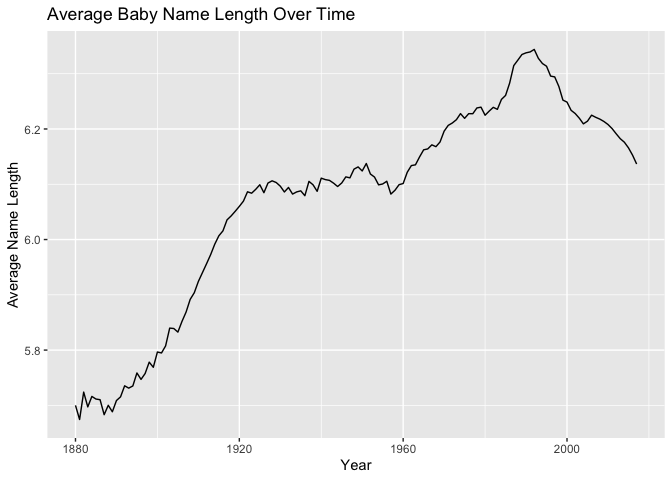<!-- -->

Until about 1990, baby names were consistently getting longer; after 1990, the trend has been towards shorter names.

Now onto part B: the popularity of first and last letters. This is going to take some R gymnastics, so here we go…. here’s my plan of attack for this analyis, since the question is pretty open-ended. I’m going to break the data into decades, and then look at the top 3 most popular first and last letters in the name variables within each decade – I’m then going to visually demonstrate preferences over decades with some neat charts. Let’s hope this works!

First, I have to prep all the data I’m going to need into a proper format: as it is in the raw data, I can’t do this analysis.

``` r
# Fn to calc decade
get_decade <- function(year) {
  return(floor(year / 10) * 10)
}

# Extract first and last letters, group by decade
letter_trends <- babynames |> 
  mutate(
    decade = get_decade(year),
    first_letter = str_sub(name, 1, 1),
    last_letter = str_sub(name, -1, -1)
  )

# Summarize counts by decade and first/last letters
first_letter_summary <- letter_trends |> 
  group_by(decade, first_letter) |> 
  summarize(total = sum(n, na.rm = TRUE)) |> 
  arrange(decade, desc(total)) |> 
  group_by(decade) |> 
  slice_max(total, n = 3) |>  # Get the top 3 first letters for each decade
  ungroup()
```

    ## `summarise()` has grouped output by 'decade'. You can override using the
    ## `.groups` argument.

``` r
last_letter_summary <- letter_trends |> 
  group_by(decade, last_letter) |> 
  summarize(total = sum(n, na.rm = TRUE)) |> 
  arrange(decade, desc(total)) |> 
  group_by(decade) |> 
  slice_max(total, n = 3) |>  # Get the top 3 last letters for each decade
  ungroup()
```

    ## `summarise()` has grouped output by 'decade'. You can override using the
    ## `.groups` argument.

Now I have the data in a ready format. Let’s plot some visuals.

``` r
library(patchwork)

p1 <- ggplot(first_letter_summary, aes(x = decade, y = total, color = first_letter)) +
  geom_line(linewidth = 1.2) +
  geom_point(size = 3) +
  labs(
    title = "Top 3 First Letters by Decade",
    x = "Decade",
    y = "Total Number of Babies",
    color = "First Letter"
  )

p2 <- ggplot(last_letter_summary, aes(x = decade, y = total, color = last_letter)) +
  geom_line(linewidth = 1.2) +
  geom_point(size = 3) +
  labs(
    title = "Top 3 Last Letters by Decade",
    x = "Decade",
    y = "Total Number of Babies",
    color = "Last Letter"
  ) 

# Use patchwork to align the two plots
p1 + p2 + 
  plot_layout(ncol = 1)  # Align the plots vertically
```

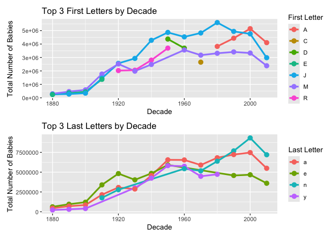<!-- -->

# 15. Regular Expressions

## 15.3.5 Exercises

**1. What baby name has the most vowels? What name has the highest proportion of vowels? (Hint: what is the denominator?)**

``` r
library(babynames)

vowels_names <- babynames |> 
  mutate(
    vowel_count = str_count(name, "[aeiouAEIOU]"),
    name_length = str_length(name),
    vowel_proportion = vowel_count / name_length
  )

# most vowels
most_vowels <- vowels_names |> 
  filter(vowel_count == max(vowel_count)) |> 
  distinct(name, vowel_count)

# highest proportion of vowels
highest_vowel_proportion <- vowels_names |> 
  filter(vowel_proportion == max(vowel_proportion)) |> 
  distinct(name, vowel_proportion)

most_vowels
```

    ## # A tibble: 2 × 2
    ##   name            vowel_count
    ##   <chr>                 <int>
    ## 1 Mariaguadalupe            8
    ## 2 Mariadelrosario           8

``` r
highest_vowel_proportion
```

    ## # A tibble: 8 × 2
    ##   name  vowel_proportion
    ##   <chr>            <dbl>
    ## 1 Eua                  1
    ## 2 Ea                   1
    ## 3 Ai                   1
    ## 4 Ia                   1
    ## 5 Ii                   1
    ## 6 Aoi                  1
    ## 7 Io                   1
    ## 8 Aia                  1

The two tables show the results. The most vowels are shared by two baby names in the dataset: Mariaguadalupe and Mariadelrosario, which each have 8 vowels.

In terms of proportion, perhaps not surprisingly, the names with the highest proportion of vowels are the names that consist entirely of vowels. (Someone named their kid “Ai”, which I find hilarious – though the child may not be as enthused.)

**2. Replace all forward slashes in “a/b/c/d/e” with backslashes. What happens if you attempt to undo the transformation by replacing all backslashes with forward slashes? (We’ll discuss the problem very soon.)**

I’m going to use `gsub()` here because it’s easier to use. The text wants us to use `str_x()` functions, which I tend to find more tedious. Anyway, I’ll illustrate both.

``` r
original_string <- "a/b/c/d/e"
backslash_string <- gsub("/", "\\\\", original_string)
str_view(backslash_string)
```

    ## [1] │ a\b\c\d\e

``` r
original_string2 <- "a/b/c/d/e"
backslash_string2 <- str_replace_all(original_string2, "/", "\\\\")
str_view(backslash_string2)
```

    ## [1] │ a\b\c\d\e

Now let’s reverse that process and see what happens:

``` r
forward_slash_string <- gsub("\\\\", "/", backslash_string)
str_view(forward_slash_string)
```

    ## [1] │ a/b/c/d/e

``` r
forward_slash_string2 <- str_replace_all(backslash_string, "\\\\", "/")
str_view(forward_slash_string2)
```

    ## [1] │ a/b/c/d/e

Well, I didn’t have a problem here. So … 🤷️?

**3. Implement a simple version of str_to_lower() using str_replace_all().**

``` r
simple_lower <- function(input_string){
  str_replace_all(input_string, setNames(letters, LETTERS))
}

simple_lower("This IS ONLY A TEST.")
```

    ## [1] "this is only a test."

**4. Create a regular expression that will match telephone numbers as commonly written in your country.**

Well, in the U.S., phone numbers come in various commonly written formats:

    1.  Standard Format: (123) 456-7890
    2.  With Dots: 123.456.7890
    3.  With Dashes: 123-456-7890
    4.  With Spaces: 123 456 7890

I’ll write a regex to handle all of the four, shown below; and then a quick little test to make sure I coded it correctly.

``` r
phone_regex <- "\\(?\\d{3}\\)?[-. ]?\\d{3}[-. ]?\\d{4}"

# Example phone numbers
phone_numbers <- c("(123) 456-7890", "123.456.7890", "123-456-7890", "123 456 7890", "1234567890")

# Use str_detect
matches <- str_detect(phone_numbers, phone_regex)

phone_numbers[matches]
```

    ## [1] "(123) 456-7890" "123.456.7890"   "123-456-7890"   "123 456 7890"  
    ## [5] "1234567890"

## 15.4.7 Exercises

**1.How would you match the literal string “’? How about”$^$“? **

Let’s start with the first string, and make sure we get the literal string properly encoded into R, as shown below:

``` r
string1 <- "\"'\\?"
str_view(string1)
```

    ## [1] │ "'\?

Now that we have the literal string coded into R, we need to code the regex version of this string in order to match it, as shown below.

``` r
# Correctly escape the backslashes for the regex
regex_pattern <- "\"'\\\\\\?"

match <- str_detect(string1, regex_pattern)
match
```

    ## [1] TRUE

I’ll combine these steps for the second literal string now that it’s clear what the process is.

``` r
string2 <- "\"$^$\"?"
str_view(string2)
```

    ## [1] │ "$^$"?

``` r
regex_pattern2 <- "\"\\$\\^\\$\"\\?"
match2 <- str_detect(string2, regex_pattern2)
match2
```

    ## [1] TRUE

**2. Explain why each of these patterns don’t match a : “",”\\“,”\\.**

First, understand that pattern matching involves evaluation in R, and then evaluation of the resulting regular expression. This must be accounted for by first escaping in R, then escaping in regex. Let’s look, then, at each of three scenarios here.

one : this is a single escape character, with nothing that escapes. That’s invalid. two \\ we now have a valid escape of  within R, but that leaves us with nothing for regex because we’ve got a literal  coming out of R. three \\ this is incomplete just like a single  would be. We successfullly escape in R, but now we have a single escape character in regex and nothing that escapes after it. This is invalid.

We need the so-called double-escape here: \\, which allows \\ to escape – and this can then be evalulated in regex as , the matching pattern we want.

**3. Given the corpus of common words in stringr::words, create regular expressions that find all words that meet the requirements (that I’ll show in the R code directly).**

``` r
# a. Start with "y"
pattern_start_y <- "^y"
start_with_y <- str_subset(words, pattern_start_y)

# b. Don’t start with "y"
pattern_not_start_y <- "^[^y]"
not_start_with_y <- str_subset(words, pattern_not_start_y)

# c. End with "x"
pattern_end_x <- "x$"
end_with_x <- str_subset(words, pattern_end_x)

# d. Are exactly three letters long
pattern_three_letters <- "^...$"
three_letters <- str_subset(words, pattern_three_letters)

# e. Have seven letters or more
pattern_seven_or_more <- "^.{7,}$"
seven_or_more <- str_subset(words, pattern_seven_or_more)

# f. Contain a vowel-consonant pair
pattern_vowel_consonant <- "[aeiou][^aeiou]"
vowel_consonant <- str_subset(words, pattern_vowel_consonant)

# g. Contain at least two vowel-consonant pairs in a row
pattern_two_vc_pairs <- "([aeiou][^aeiou]){2}"
two_vc_pairs <- str_subset(words, pattern_two_vc_pairs)

# h. Only consist of repeated vowel-consonant pairs
pattern_only_vc_pairs <- "^([aeiou][^aeiou])+$"
only_vc_pairs <- str_subset(words, pattern_only_vc_pairs)

# results
list(
  head(start_with_y),
  head(not_start_with_y),
  head(end_with_x),
  head(three_letters),
  head(seven_or_more),
  head(vowel_consonant),
  head(two_vc_pairs),
  head(only_vc_pairs)
)
```

    ## [[1]]
    ## [1] "year"      "yes"       "yesterday" "yet"       "you"       "young"    
    ## 
    ## [[2]]
    ## [1] "a"        "able"     "about"    "absolute" "accept"   "account" 
    ## 
    ## [[3]]
    ## [1] "box" "sex" "six" "tax"
    ## 
    ## [[4]]
    ## [1] "act" "add" "age" "ago" "air" "all"
    ## 
    ## [[5]]
    ## [1] "absolute"  "account"   "achieve"   "address"   "advertise" "afternoon"
    ## 
    ## [[6]]
    ## [1] "able"     "about"    "absolute" "accept"   "account"  "achieve" 
    ## 
    ## [[7]]
    ## [1] "absolute" "agent"    "along"    "america"  "another"  "apart"   
    ## 
    ## [[8]]
    ## [1] "as"     "at"     "away"   "eleven" "even"   "ever"

I’ve only printed using `head()` because some of these word lists would be very large otherwise. Looking at a few records will show that the matching works as expected in each instance.

**4. Create 11 regular expressions that match the British or American spellings for each of the following words: airplane/aeroplane, aluminum/aluminium, analog/analogue, ass/arse, center/centre, defense/defence, donut/doughnut, gray/grey, modeling/modelling, skeptic/sceptic, summarize/summarise. Try and make the shortest possible regex! **

Sheesh, it would be nice if some of these questions at least gave us the R code we need to start with! I’ve done the work below concatenating the desired works into a vector and then performing the regex matching.

``` r
words <- c("airplane", "aeroplane", "aluminum", "aluminium", "analog", "analogue", 
           "ass", "arse", "center", "centre", "defense", "defence", 
           "donut", "doughnut", "gray", "grey", "modeling", "modelling", 
           "skeptic", "sceptic", "summarize", "summarise")

# Regular expressions for British and American spellings
regex_list <- list(
  airplane_aeroplane = "a(ero|ir)plane",
  aluminum_aluminium = "alumin(um|ium)",
  analog_analogue = "analog(|ue)",
  ass_arse = "a(ss|rse)",
  center_centre = "cent(e|re)",
  defense_defence = "defen[cs]e",
  donut_doughnut = "d(ough|o)nut",
  gray_grey = "gr[ae]y",
  modeling_modelling = "model(l)?ing",
  skeptic_sceptic = "s(c|k)eptic",
  summarize_summarise = "summari[sz]e"
)

# Matchy matchy
results <- lapply(regex_list, function(pattern) {
  str_subset(words, pattern)
})

# Display the results
results
```

    ## $airplane_aeroplane
    ## [1] "airplane"  "aeroplane"
    ## 
    ## $aluminum_aluminium
    ## [1] "aluminum"  "aluminium"
    ## 
    ## $analog_analogue
    ## [1] "analog"   "analogue"
    ## 
    ## $ass_arse
    ## [1] "ass"  "arse"
    ## 
    ## $center_centre
    ## [1] "center" "centre"
    ## 
    ## $defense_defence
    ## [1] "defense" "defence"
    ## 
    ## $donut_doughnut
    ## [1] "donut"    "doughnut"
    ## 
    ## $gray_grey
    ## [1] "gray" "grey"
    ## 
    ## $modeling_modelling
    ## [1] "modeling"  "modelling"
    ## 
    ## $skeptic_sceptic
    ## [1] "skeptic" "sceptic"
    ## 
    ## $summarize_summarise
    ## [1] "summarize" "summarise"

**5. Switch the first and last letters in words. Which of those strings are still words? **

``` r
# swap letters function
swap_letters <- function(word) {
  if (str_length(word) <= 1) {
    return(word)
  }
  first_letter <- str_sub(word, 1, 1)
  last_letter <- str_sub(word, -1, -1)
  middle <- str_sub(word, 2, -2)
  
  swapped_word <- str_c(last_letter, middle, first_letter)
  return(swapped_word)
}

# Apply swap to all words
swapped_words <- sapply(words, swap_letters)

# recheck words to see what swapped words exist therein
valid_swapped_words <- swapped_words[swapped_words %in% words]

valid_swapped_words
```

    ## named character(0)

``` r
length(valid_swapped_words)
```

    ## [1] 0

**6. Describe in words what these regular expressions match: (read carefully to see if each entry is a regular expression or a string that defines a regular expression.) **

    1.  ^.*$: Matches any line of text, including empty lines.
    2.  "\\{.+\\}": Matches any string enclosed within curly braces {}.
    3.  \d{4}-\d{2}-\d{2}: Matches a date in the format YYYY-MM-DD.
    4.  "\\\\{4}": Matches exactly four consecutive backslashes.
    5.  \..\..\..: Matches any three characters separated by dots.
    6.  (.)\1\1: Matches any character repeated three times in a row.
    7.  "(..)\\1": Matches two characters followed by the same two characters within double quotes.

**7. Solve the beginner regexp crosswords at <https://regexcrossword.com/challenges/beginner>**

The results of that work aren’t shown in this document.

## 15.6.4 Exercises

**1. For each of the following challenges, try solving it by using both a single regular expression, and a combination of multiple str_detect() calls. **

**a. Find all words that start or end with x.**

``` r
# Using a regular expression
str_subset(words, "^x|x$")
```

    ## character(0)

``` r
# Using str_detect()
words_start_x <- words[str_detect(words, "^x")]
words_end_x <- words[str_detect(words, "x$")]
unique(c(words_start_x, words_end_x))
```

    ## character(0)

**b. Find all words that start with a vowel and end with a consonant.**

``` r
# Using a regular expression
str_subset(words, "^[aeiou].*[^aeiou]$")
```

    ## [1] "aluminum"  "aluminium" "analog"    "ass"

``` r
# Using str_detect()
words_start_v <- words[str_detect(words, "^[aeiou]")]
words_end_c <- words[str_detect(words, "[^aeiou]$")]
intersect(words_start_v, words_end_c)
```

    ## [1] "aluminum"  "aluminium" "analog"    "ass"

**c. Are there any words that contain at least one of each different vowel?**

``` r
# Using a regular expression
str_subset(words, "(?=.*a)(?=.*e)(?=.*i)(?=.*o)(?=.*u)")
```

    ## character(0)

We’ll stop with the regex, no need to go further: there are no words containing at least one of each different vowel.

**2. Construct patterns to find evidence for and against the rule “i before e except after c”?**

``` r
# Using a regular expression
rule_against <- str_subset(words, "cie")
rule_for <- str_subset(words, "cei")

rule_against
```

    ## character(0)

``` r
rule_for
```

    ## character(0)

**3. `colors()` contains a number of modifiers like “lightgray” and “darkblue”. How could you automatically identify these modifiers? (Think about how you might detect and then remove the colors that are modified). **

To do this, we observe that the modifiers start the string for each color. We would need to know the universe of modifiers to be complete (a different question than the one that was asked), but in the below code I show how to identify the modifiers.

``` r
str_subset(colors(), "^(light|dark|pale|deep)")
```

    ##   [1] "darkblue"             "darkcyan"             "darkgoldenrod"       
    ##   [4] "darkgoldenrod1"       "darkgoldenrod2"       "darkgoldenrod3"      
    ##   [7] "darkgoldenrod4"       "darkgray"             "darkgreen"           
    ##  [10] "darkgrey"             "darkkhaki"            "darkmagenta"         
    ##  [13] "darkolivegreen"       "darkolivegreen1"      "darkolivegreen2"     
    ##  [16] "darkolivegreen3"      "darkolivegreen4"      "darkorange"          
    ##  [19] "darkorange1"          "darkorange2"          "darkorange3"         
    ##  [22] "darkorange4"          "darkorchid"           "darkorchid1"         
    ##  [25] "darkorchid2"          "darkorchid3"          "darkorchid4"         
    ##  [28] "darkred"              "darksalmon"           "darkseagreen"        
    ##  [31] "darkseagreen1"        "darkseagreen2"        "darkseagreen3"       
    ##  [34] "darkseagreen4"        "darkslateblue"        "darkslategray"       
    ##  [37] "darkslategray1"       "darkslategray2"       "darkslategray3"      
    ##  [40] "darkslategray4"       "darkslategrey"        "darkturquoise"       
    ##  [43] "darkviolet"           "deeppink"             "deeppink1"           
    ##  [46] "deeppink2"            "deeppink3"            "deeppink4"           
    ##  [49] "deepskyblue"          "deepskyblue1"         "deepskyblue2"        
    ##  [52] "deepskyblue3"         "deepskyblue4"         "lightblue"           
    ##  [55] "lightblue1"           "lightblue2"           "lightblue3"          
    ##  [58] "lightblue4"           "lightcoral"           "lightcyan"           
    ##  [61] "lightcyan1"           "lightcyan2"           "lightcyan3"          
    ##  [64] "lightcyan4"           "lightgoldenrod"       "lightgoldenrod1"     
    ##  [67] "lightgoldenrod2"      "lightgoldenrod3"      "lightgoldenrod4"     
    ##  [70] "lightgoldenrodyellow" "lightgray"            "lightgreen"          
    ##  [73] "lightgrey"            "lightpink"            "lightpink1"          
    ##  [76] "lightpink2"           "lightpink3"           "lightpink4"          
    ##  [79] "lightsalmon"          "lightsalmon1"         "lightsalmon2"        
    ##  [82] "lightsalmon3"         "lightsalmon4"         "lightseagreen"       
    ##  [85] "lightskyblue"         "lightskyblue1"        "lightskyblue2"       
    ##  [88] "lightskyblue3"        "lightskyblue4"        "lightslateblue"      
    ##  [91] "lightslategray"       "lightslategrey"       "lightsteelblue"      
    ##  [94] "lightsteelblue1"      "lightsteelblue2"      "lightsteelblue3"     
    ##  [97] "lightsteelblue4"      "lightyellow"          "lightyellow1"        
    ## [100] "lightyellow2"         "lightyellow3"         "lightyellow4"        
    ## [103] "palegoldenrod"        "palegreen"            "palegreen1"          
    ## [106] "palegreen2"           "palegreen3"           "palegreen4"          
    ## [109] "paleturquoise"        "paleturquoise1"       "paleturquoise2"      
    ## [112] "paleturquoise3"       "paleturquoise4"       "palevioletred"       
    ## [115] "palevioletred1"       "palevioletred2"       "palevioletred3"      
    ## [118] "palevioletred4"

**4. Create a regular expression that finds any base R dataset. You can get a list of these datasets via a special use of the data() function: data(package = “datasets”)\$results\[, “Item”\]. Note that a number of old datasets are individual vectors; these contain the name of the grouping “data frame” in parentheses, so you’ll need to strip those off.**

``` r
datasets_list <- data(package = "datasets")$results[, "Item"]

str_remove(datasets_list, "\\s*\\(.*\\)$")
```

    ##   [1] "AirPassengers"         "BJsales"               "BJsales.lead"         
    ##   [4] "BOD"                   "CO2"                   "ChickWeight"          
    ##   [7] "DNase"                 "EuStockMarkets"        "Formaldehyde"         
    ##  [10] "HairEyeColor"          "Harman23.cor"          "Harman74.cor"         
    ##  [13] "Indometh"              "InsectSprays"          "JohnsonJohnson"       
    ##  [16] "LakeHuron"             "LifeCycleSavings"      "Loblolly"             
    ##  [19] "Nile"                  "Orange"                "OrchardSprays"        
    ##  [22] "PlantGrowth"           "Puromycin"             "Seatbelts"            
    ##  [25] "Theoph"                "Titanic"               "ToothGrowth"          
    ##  [28] "UCBAdmissions"         "UKDriverDeaths"        "UKgas"                
    ##  [31] "USAccDeaths"           "USArrests"             "USJudgeRatings"       
    ##  [34] "USPersonalExpenditure" "UScitiesD"             "VADeaths"             
    ##  [37] "WWWusage"              "WorldPhones"           "ability.cov"          
    ##  [40] "airmiles"              "airquality"            "anscombe"             
    ##  [43] "attenu"                "attitude"              "austres"              
    ##  [46] "beaver1"               "beaver2"               "cars"                 
    ##  [49] "chickwts"              "co2"                   "crimtab"              
    ##  [52] "discoveries"           "esoph"                 "euro"                 
    ##  [55] "euro.cross"            "eurodist"              "faithful"             
    ##  [58] "fdeaths"               "freeny"                "freeny.x"             
    ##  [61] "freeny.y"              "infert"                "iris"                 
    ##  [64] "iris3"                 "islands"               "ldeaths"              
    ##  [67] "lh"                    "longley"               "lynx"                 
    ##  [70] "mdeaths"               "morley"                "mtcars"               
    ##  [73] "nhtemp"                "nottem"                "npk"                  
    ##  [76] "occupationalStatus"    "precip"                "presidents"           
    ##  [79] "pressure"              "quakes"                "randu"                
    ##  [82] "rivers"                "rock"                  "sleep"                
    ##  [85] "stack.loss"            "stack.x"               "stackloss"            
    ##  [88] "state.abb"             "state.area"            "state.center"         
    ##  [91] "state.division"        "state.name"            "state.region"         
    ##  [94] "state.x77"             "sunspot.month"         "sunspot.year"         
    ##  [97] "sunspots"              "swiss"                 "treering"             
    ## [100] "trees"                 "uspop"                 "volcano"              
    ## [103] "warpbreaks"            "women"

# 16. Factors

## 16.3.1 Exercises

**1. Explore the distribution of rincome (reported income). What makes the default bar chart hard to understand? How could you improve the plot?**

``` r
ggplot(gss_cat, aes(x = rincome)) +
  geom_bar()
```

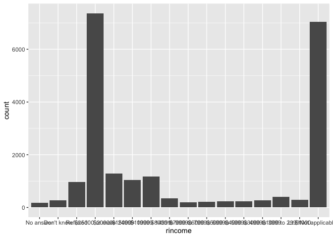<!-- -->

A standard bar chart is definitely hard to understand because the x axis labels are blending together – also because the factor order doesn’t lend itself to distributional visualization. We can fix both as shown in the code below.

``` r
gss_cat <- gss_cat |> 
  mutate(rincome = fct_collapse(rincome,
                                "Not given" = c("No answer", 
                                                "Don't know", 
                                                "Refused", 
                                                "Not applicable")),
         rincome = fct_relevel(rincome, "Not given", after = Inf))

# Plot the updated rincome distribution
ggplot(gss_cat, aes(x = rincome)) +
  geom_bar() +
  coord_flip() +
  labs(x = "Reported Income", 
       y = "Count", 
       title = "Distribution of Reported Income in GSS Dataset, revised",
       subtitle = "'Not given' combines all non-ranged answers")
```

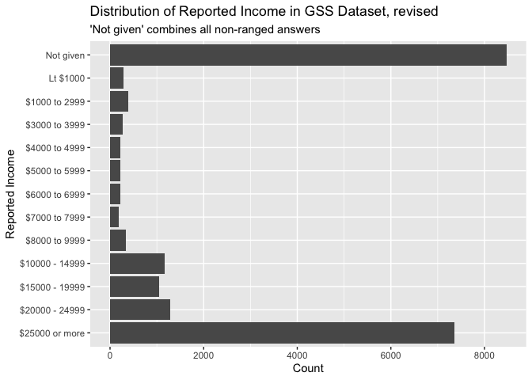<!-- -->

**2. What is the most common relig in this survey? What’s the most common partyid?**

``` r
# Most common religion
most_common_relig <- gss_cat |> 
  count(relig, sort = TRUE) |> 
  slice_max(n, n = 1)

# Most common party ID
most_common_partyid <- gss_cat |> 
  count(partyid, sort = TRUE) |> 
  slice_max(n, n = 1)

most_common_relig
```

    ## # A tibble: 1 × 2
    ##   relig          n
    ##   <fct>      <int>
    ## 1 Protestant 10846

``` r
most_common_partyid
```

    ## # A tibble: 1 × 2
    ##   partyid         n
    ##   <fct>       <int>
    ## 1 Independent  4119

**3. Which relig does denom (denomination) apply to? How can you find out with a table? How can you find out with a visualization?**

``` r
# table to view relig and denom relationship
relig_denom_table <- gss_cat |> 
  count(relig, denom) |> 
  pivot_wider(names_from = denom, values_from = n, values_fill = 0)

relig_denom_table
```

    ## # A tibble: 15 × 31
    ##    relig       `No answer` `Not applicable` `Don't know` `No denomination` Other
    ##    <fct>             <int>            <int>        <int>             <int> <int>
    ##  1 No answer            93                0            0                 0     0
    ##  2 Don't know            0               15            0                 0     0
    ##  3 Inter-nond…           0              109            0                 0     0
    ##  4 Native ame…           0               23            0                 0     0
    ##  5 Christian             2              224           11               452     0
    ##  6 Orthodox-c…           0               95            0                 0     0
    ##  7 Moslem/isl…           0              104            0                 0     0
    ##  8 Other east…           0               32            0                 0     0
    ##  9 Hinduism              0               71            0                 0     0
    ## 10 Buddhism              0              147            0                 0     0
    ## 11 Other                 0              217            0                 7     0
    ## 12 None                  0             3523            0                 0     0
    ## 13 Jewish                0              388            0                 0     0
    ## 14 Catholic              0             5124            0                 0     0
    ## 15 Protestant           22                0           41              1224  2534
    ## # ℹ 25 more variables: Episcopal <int>, `Presbyterian-dk wh` <int>,
    ## #   `Presbyterian, merged` <int>, `Other presbyterian` <int>,
    ## #   `United pres ch in us` <int>, `Presbyterian c in us` <int>,
    ## #   `Lutheran-dk which` <int>, `Evangelical luth` <int>,
    ## #   `Other lutheran` <int>, `Wi evan luth synod` <int>,
    ## #   `Lutheran-mo synod` <int>, `Luth ch in america` <int>, `Am lutheran` <int>,
    ## #   `Methodist-dk which` <int>, `Other methodist` <int>, …

``` r
# via visualization
ggplot(gss_cat, aes(x = relig, fill = denom)) +
  geom_bar(position = "fill") +
  coord_flip() +
  labs(x = "Religion", y = "Proportion", fill = "Denomination", title = "Relationship between Religion and Denomination")
```

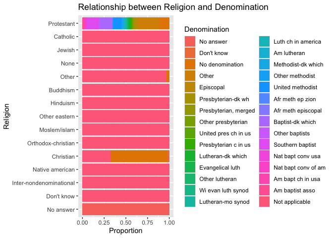<!-- -->

The chart makes it easier to see: generally speaking, denomination comes into play when looking primarily at Protestant religion, or Christian religion. It also appears in a small proportion of Other religion responses.

This does beg the question, however, about the data itself: Protestants are themselves a denomination of Christianity. Not sure why they’d be categorized as a seperate religion – nor why Baptists, for example, are considered a denomination of Protestantism. Or Lutherans for that matter. That’s actually inaccurate. But anyway, this is what the data shows.

## 16.4.1 Exercises

**1. There are some suspiciously high numbers in tvhours. Is the mean a good summary?**

``` r
# Plot the distribution of tvhours
ggplot(gss_cat, aes(x = tvhours)) +
  geom_histogram(binwidth = 1, fill = "steelblue", color = "black") +
  labs(x = "Hours Watching TV", y = "Count", title = "Distribution of TV Hours in GSS Dataset")
```

    ## Warning: Removed 10146 rows containing non-finite outside the scale range
    ## (`stat_bin()`).

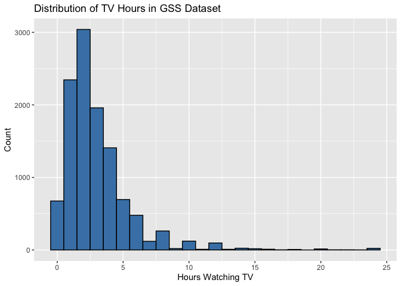<!-- -->

Looking at the distribution of TV hours, it’s interesting to see that there are some people saying they watch more than 15 hours per day. Those people exist (my Mom among them), but I suspect they are outliers moreseo than anything else. Especially for anyone saying they watch TV 24 hours per day – that means they don’t sleep. Also of note is that the distribution is highly skewed here.

Let’s look at a few key measures to see what’s going on:

``` r
gss_cat |> 
  summarize(
    mean_tvhours = mean(tvhours, na.rm = TRUE),
    median_tvhours = median(tvhours, na.rm = TRUE),
    max_tvhours = max(tvhours, na.rm = TRUE)
  )
```

    ## # A tibble: 1 × 3
    ##   mean_tvhours median_tvhours max_tvhours
    ##          <dbl>          <int>       <int>
    ## 1         2.98              2          24

The mean is nearly one full hour larger than the median. In this case, I’d suggest using the median or perhaps a trimmed mean to get a good identifier of centrality of the data.

**2. For each factor in gss_cat identify whether the order of the levels is arbitrary or principled.**

Let’s see the data first:

``` r
glimpse(gss_cat)
```

    ## Rows: 21,483
    ## Columns: 9
    ## $ year    <int> 2000, 2000, 2000, 2000, 2000, 2000, 2000, 2000, 2000, 2000, 20…
    ## $ marital <fct> Never married, Divorced, Widowed, Never married, Divorced, Mar…
    ## $ age     <int> 26, 48, 67, 39, 25, 25, 36, 44, 44, 47, 53, 52, 52, 51, 52, 40…
    ## $ race    <fct> White, White, White, White, White, White, White, White, White,…
    ## $ rincome <fct> $8000 to 9999, $8000 to 9999, Not given, Not given, Not given,…
    ## $ partyid <fct> "Ind,near rep", "Not str republican", "Independent", "Ind,near…
    ## $ relig   <fct> Protestant, Protestant, Protestant, Orthodox-christian, None, …
    ## $ denom   <fct> "Southern baptist", "Baptist-dk which", "No denomination", "No…
    ## $ tvhours <int> 12, NA, 2, 4, 1, NA, 3, NA, 0, 3, 2, NA, 1, NA, 1, 7, NA, 3, 3…

- Marital: arbitrary

- Race: arbitrary

- Rincome: principled

- PartyID: arbitrary

- Relig: arbitrary

- Denom: arbitrary

**3. Why did moving “Not applicable” to the front of the levels move it to the bottom of the plot?**

Because the levels are printed from first to last by bottom to top in the chart.

## 16.5.1 Exercises

**1. How have the proportions of people identifying as Democrat, Republican, and Independent changed over time?**

``` r
gss_party <- gss_cat |> 
  mutate(
    partyid_grouped = case_when(
      partyid %in% c("Strong democrat", "Not str democrat") ~ "Democrat",
      partyid %in% c("Strong republican", "Not str republican") ~ "Republican",
      partyid %in% c("Independent", "Ind,near rep", "Ind,near dem") ~ "Independent",
      TRUE ~ "Other"
    )
  ) |> 
  filter(partyid_grouped != "Other") |>  # Filter out "Other" group
  group_by(year, partyid_grouped) |> 
  summarize(count = n(), .groups = 'drop') |> 
  group_by(year) |> 
  mutate(proportion = count / sum(count))

# Visualize the proportions over time
ggplot(gss_party, aes(x = year, y = proportion, color = partyid_grouped)) +
  geom_line(size = 1) +
  labs(
    title = "Political Affiliation Over Time",
    x = "Year",
    y = "Proportion",
    color = "Party ID"
  )
```

    ## Warning: Using `size` aesthetic for lines was deprecated in ggplot2 3.4.0.
    ## ℹ Please use `linewidth` instead.
    ## This warning is displayed once every 8 hours.
    ## Call `lifecycle::last_lifecycle_warnings()` to see where this warning was
    ## generated.

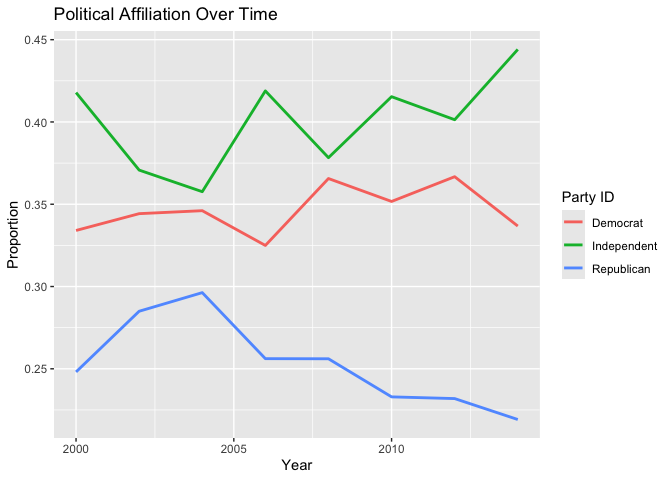<!-- -->

**2. How could you collapse rincome into a small set of categories?**

I did a little bit of this above in an earlier question, but will re-illustrate it here by taking the concept a little further along. (Note that)

``` r
gss_cat <- gss_cat |> 
  mutate(rincome = fct_collapse(rincome,
                                "Not given" = c("No answer", 
                                                "Don't know", 
                                                "Refused", 
                                                "Not applicable"),
                                "$7k and below" = c("Lt $1000",
                                                    "$1000 to $2999",
                                                    "$3000 to $3999",
                                                    "$4000 to $4999",
                                                    "$5000 to $5999",
                                                    "$6000 to $6999",
                                                    "$7000 to $7999")))
```

    ## Warning: There was 1 warning in `mutate()`.
    ## ℹ In argument: `rincome = fct_collapse(...)`.
    ## Caused by warning:
    ## ! Unknown levels in `f`: No answer, Don't know, Refused, Not applicable, $1000 to $2999, $3000 to $3999, $4000 to $4999, $5000 to $5999, $6000 to $6999, $7000 to $7999

``` r
levels(gss_cat$rincome)
```

    ##  [1] "$25000 or more" "$20000 - 24999" "$15000 - 19999" "$10000 - 14999"
    ##  [5] "$8000 to 9999"  "$7000 to 7999"  "$6000 to 6999"  "$5000 to 5999" 
    ##  [9] "$4000 to 4999"  "$3000 to 3999"  "$1000 to 2999"  "$7k and below" 
    ## [13] "Not given"

*(You’ll notice there is an error message about unknown levels. That’s because I already modified the underlying dataset, as shown by the output – running the code again means it won’t find the prior levels.)*

**3. Notice there are 9 groups (excluding other) in the fct_lump example above. Why not 10? (Hint: type ?fct_lump, and find the default for the argument other_level is “Other”.)**

This is simple, if you specify ten group, the `fct_lump()` function automatically will reserve a bin called “Other” for everything that isn’t fitting into the other factor bins – so you get 9+1 = 10 bins.

# 17. Dates and times

# 18. Missing values

# 19. Joins
